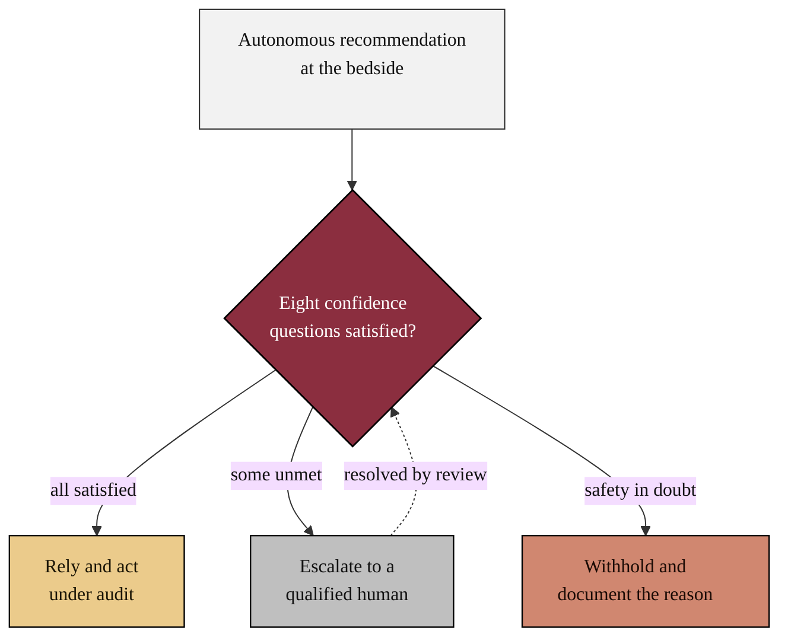

# mermaid - Stage 1: 20 colored Mermaid figures

This directory is the output of **Stage 1** (sub-prompt
[`../sub-prompts/prompt-1-mermaid.md`](../sub-prompts/prompt-1-mermaid.md)): a
curated set of **20 professional, colored Mermaid figures** that illustrate the
eight confidence-question sections and the bedside adoption argument of the
clinician confidence framework. Each figure lives in its own file under
[`diagrams/`](diagrams/) and was pushed as its own commit; the catalog
[`output-mermaid.md`](output-mermaid.md) embeds all 20 for GitHub rendering.

## The core mechanism

## Palette (strict)

| Role | Fill | Text | Meaning |
|:--|:--|:--|:--|
| `act` | `#8B2E3F` | white | verification, the gate, clinician authority |
| `hope` | `#EBCB8B` | black | confidence, benefit, accepted outcome |
| `risk` | `#D08770` | black | harm, risk, the withheld or blocked action |
| `n1` / `n2` / `n3` | grays | black | inputs, steps, gates |

No raster images are used. The `#8B2E3F` paper template theme is preserved, and no
hue outside the palette appears in any figure.

## The 20 figures and their slots

| # | File | Type | Confidence slot |
|:--|:--|:--|:--|
| 01 | `01-bedside-trust-decision.md` | flowchart | Framework |
| 02 | `02-eight-confidence-questions.md` | flowchart | Introduction |
| 03 | `03-verification-before-generation.md` | flowchart | Framework |
| 04 | `04-ten-vvuq-gates.md` | flowchart | 2 Safety |
| 05 | `05-calibrated-trust-quadrant.md` | quadrant | Introduction |
| 06 | `06-competence-evidence-stack.md` | flowchart | 1 Competence |
| 07 | `07-safety-containment-flow.md` | flowchart | 2 Safety |
| 08 | `08-audit-trail-sequence.md` | sequence | 3 Transparency |
| 09 | `09-oversight-loop-state.md` | state | 4 Oversight |
| 10 | `10-subgroup-equity-quadrant.md` | quadrant | 5 Equity |
| 11 | `11-clinician-workflow-journey.md` | journey | 8 Workflow |
| 12 | `12-adoption-maturity-timeline.md` | timeline | Framework |
| 13 | `13-accountability-raci.md` | flowchart | 7 Accountability |
| 14 | `14-escalation-pathway-sequence.md` | sequence | 4 Oversight |
| 15 | `15-uncertainty-gate-flow.md` | flowchart | 6 Reliability |
| 16 | `16-model-revalidation-gitgraph.md` | gitGraph | 6 Reliability |
| 17 | `17-night-shift-sequence.md` | sequence | 6 Reliability |
| 18 | `18-tumor-board-defensibility-mindmap.md` | mindmap | 3 Transparency |
| 19 | `19-override-stop-state.md` | state | 4 Oversight |
| 20 | `20-bedside-to-trial-trust-capstone.md` | flowchart | Appendix capstone |

Eight distinct Mermaid diagram types are used (flowchart, quadrant, sequence,
state, journey, timeline, gitGraph, mindmap) so no figure repeats another's pattern
unnecessarily, and each type is matched to the structure of its content.

## Sources used from other directories (Rule 6)

| Asset | Upstream source | Used in |
|:--|:--|:--|
| Colored Mermaid families, palette, and per-type theming | `review/mermaid/` | every figure |
| The verification-before-generation mechanism and the ten gates | `review/` and `review/references/author_works.bib` | figures 03, 04, 07 |
| Calibrated trust, automation bias, algorithm aversion | `../references/framework_refs.bib` | figures 05, 09, 19 |

Each Markdown Mermaid figure is reproduced in the compiled LaTeX framework as a
matching colored TikZ figure in the same palette, refined across the draft, full,
and final stages.

## License

CC BY 4.0. Author: Kevin Kawchak, CEO ChemicalQDevice
([ORCID 0009-0007-5457-8667](https://orcid.org/0009-0007-5457-8667)).
