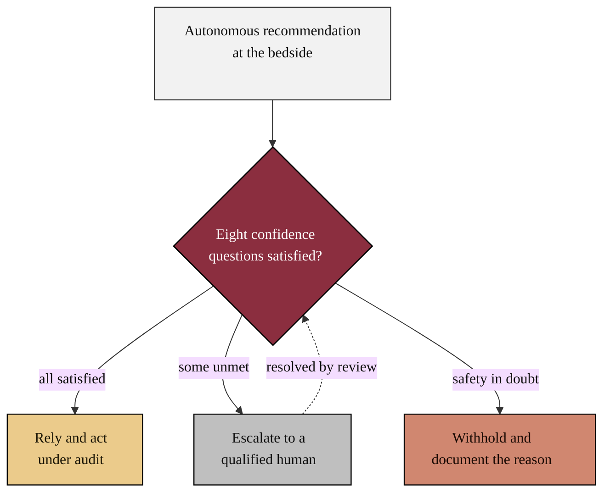

### 01. The Bedside Trust Decision

The core idea of the framework in one figure: when an autonomous system proposes
an action at the bedside, the clinician runs the eight confidence questions and
then relies on it under audit, escalates it to a qualified human, or withholds it
and documents why. A flowchart is correct because the content is a directed
control flow that ends in a single decision with three guarded outcomes.
Reproduced in the compiled LaTeX framework as a matching colored TikZ figure
(palette: black, grayscales, #EBCB8B, #D08770, #8B2E3F).

