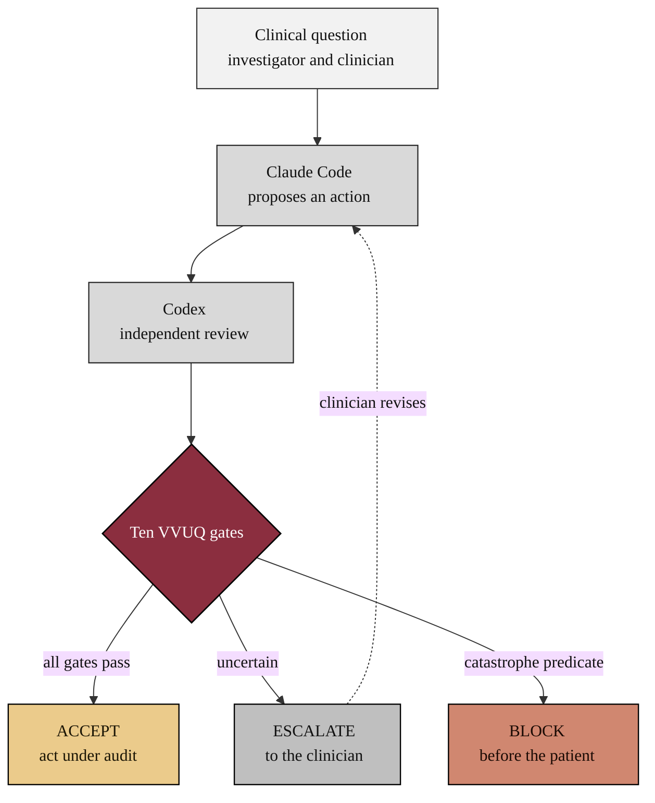

### 03. Verification Before Generation, the Clinician's View

The mechanism the framework rests on, seen from the clinician's seat: a clinical
question is posed, Claude Code proposes a candidate action, Codex reviews it
independently, and a ten-gate VVUQ check resolves to ACCEPT, ESCALATE to the
clinician, or BLOCK before anything reaches the patient. A flowchart is correct
because the content is a directed control flow with a decision node. Reproduced in
the compiled LaTeX framework as a matching colored TikZ figure (palette: black,
grayscales, #EBCB8B, #D08770, #8B2E3F).

