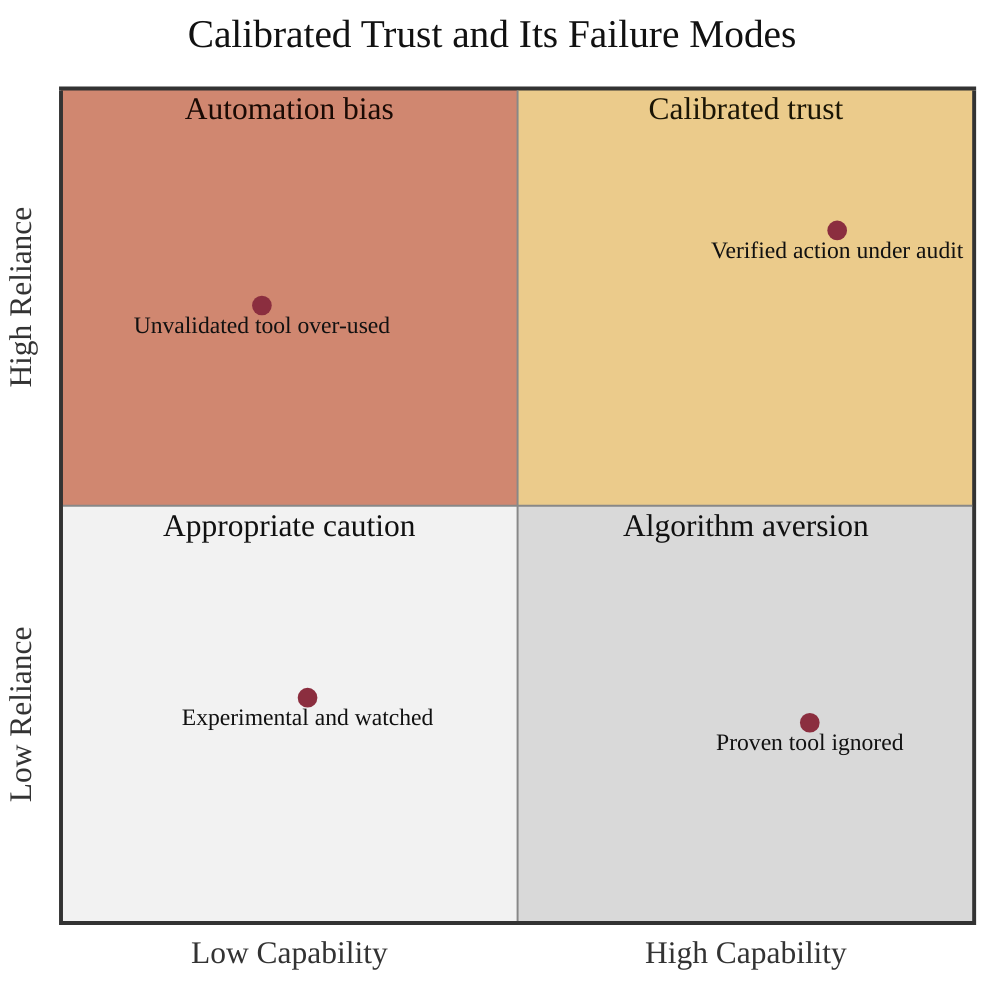

### 05. The Calibrated-Trust Band

The framework's organizing concept: a clinician should rely on a system exactly as
much as its demonstrated capability warrants. Plotting demonstrated capability
against clinician reliance separates calibrated trust from its two failure modes,
automation bias (over-trust) and algorithm aversion (under-trust). A quadrant chart
is correct because the content compares states on two continuous axes. Reproduced
in the compiled LaTeX framework as a matching colored TikZ figure (palette: black,
grayscales, #EBCB8B, #D08770, #8B2E3F).

