### 06. The Competence Evidence Stack

Competence is not one number but a stack of evidence built in order: bench
accuracy, a retrospective cohort, prospective validation on the site's own
patients, and the assurance run that passed every automated gate test. A
phase-grouped flowchart is correct because it shows independent evidence stages
that build to a single conclusion. Reproduced in the compiled LaTeX framework as a
matching colored TikZ figure (palette: black, grayscales, #EBCB8B, #D08770,
#8B2E3F).

```mermaid
%%{init: {'theme':'base','themeVariables':{'fontFamily':'Helvetica, Arial, sans-serif','lineColor':'#333333','primaryTextColor':'#111111','clusterBkg':'#F2F2F2','clusterBorder':'#888888'},'flowchart':{'curve':'basis','nodeSpacing':28,'rankSpacing':46,'htmlLabels':true}}}%%
flowchart LR
  subgraph BENCH["Bench"]
    B1["Benchmark accuracy"]:::n1
  end
  subgraph RETRO["Retrospective"]
    R1["Historical cohort agreement"]:::n2
  end
  subgraph PROSP["Prospective"]
    P1["Validation on site population"]:::n2
  end
  subgraph ASSURE["Assurance"]
    A1["172 of 172 gate tests"]:::act
  end
  CONF["Competence established"]:::hope
  B1 --> R1 --> P1 --> A1 --> CONF
  classDef act fill:#8B2E3F,stroke:#000000,stroke-width:1.4px,color:#ffffff
  classDef hope fill:#EBCB8B,stroke:#000000,stroke-width:1.2px,color:#1A1505
  classDef n1 fill:#F2F2F2,stroke:#333333,stroke-width:1.1px,color:#111111
  classDef n2 fill:#D9D9D9,stroke:#222222,stroke-width:1.1px,color:#111111
  classDef n3 fill:#BFBFBF,stroke:#000000,stroke-width:1.2px,color:#111111
```

