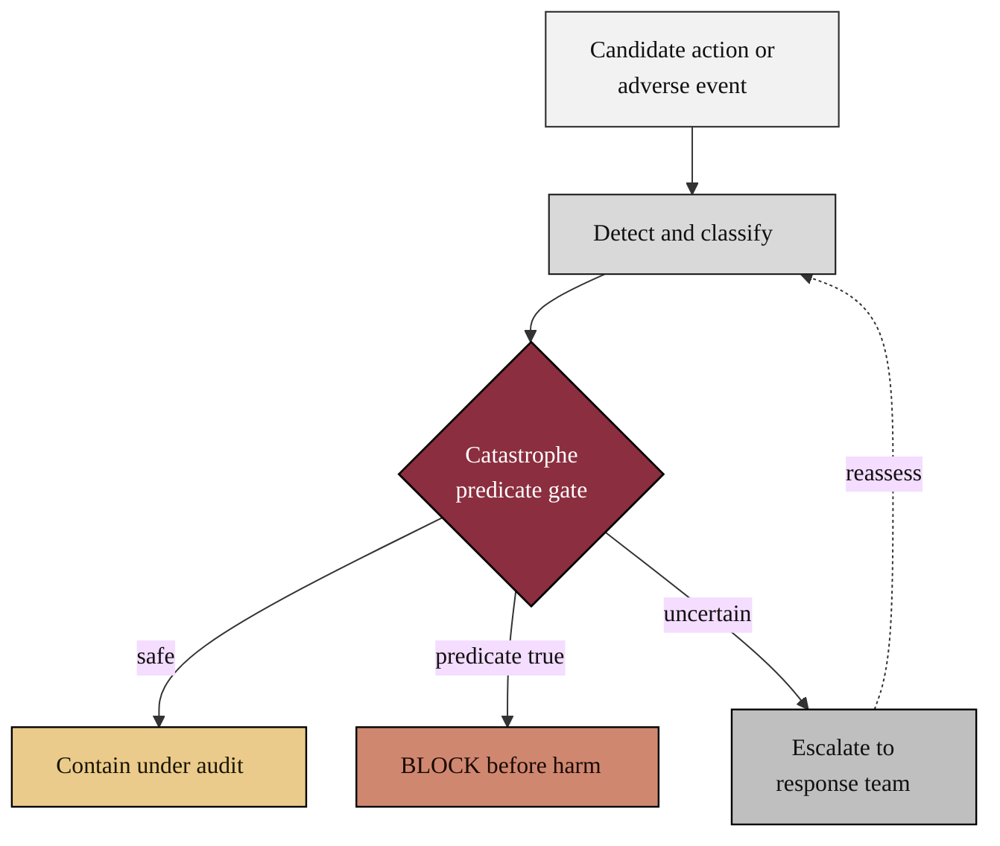

### 07. Safety Containment

The safety case in motion: a candidate action or a detected adverse event is
classified, checked against the catastrophe-predicate gate, and then either
contained under audit, blocked before harm, or escalated to the response team. A
flowchart is correct because the content is a directed control flow with a guarded
decision. Reproduced in the compiled LaTeX framework as a matching colored TikZ
figure (palette: black, grayscales, #EBCB8B, #D08770, #8B2E3F).

