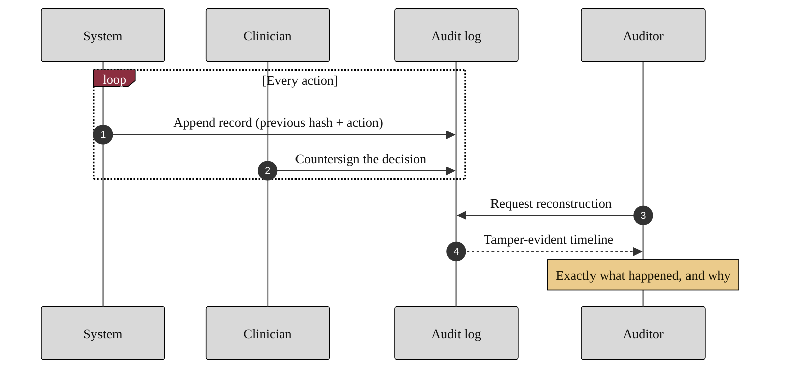

### 08. The Audit Trail a Clinician Can Show

Transparency is operational, not rhetorical: every action appends a hash-chained
record, the clinician countersigns the decision, and an auditor can later
reconstruct exactly what happened and why. A sequence diagram is correct because
the content is an ordered exchange of messages between named parties over time.
Reproduced in the compiled LaTeX framework as a matching colored TikZ figure
(palette: black, grayscales, #EBCB8B, #D08770, #8B2E3F).

