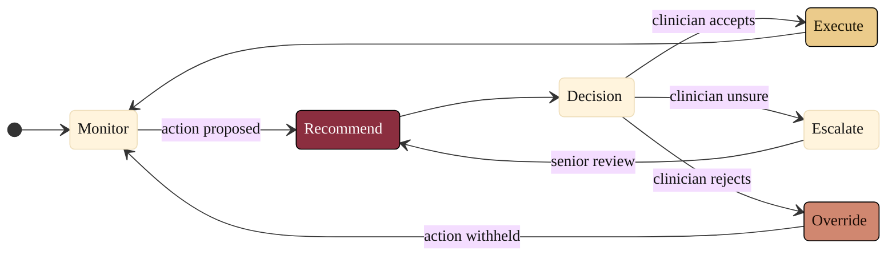

### 09. The Human-in-the-Loop Oversight Loop

Oversight is a loop the clinician never leaves: the system monitors, recommends,
and presents a decision the clinician accepts, escalates, or overrides, after
which control returns to monitoring. A state diagram is correct because the content
is a set of discrete states with guarded transitions and a choice. Reproduced in
the compiled LaTeX framework as a matching colored TikZ figure (palette: black,
grayscales, #EBCB8B, #D08770, #8B2E3F).

