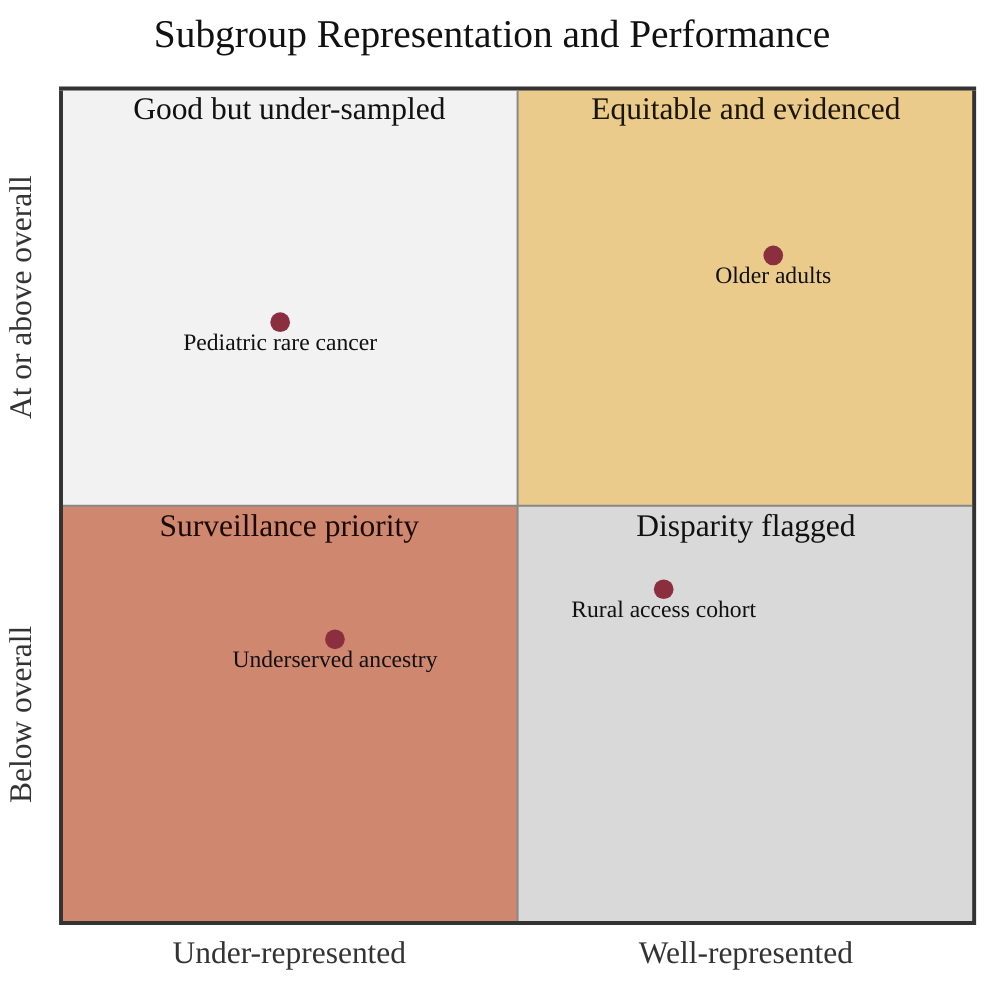

### 10. The Subgroup Equity Map

Equity is measured, not assumed: each clinically relevant subgroup is plotted by
its representation in validation against its performance relative to the overall
model, so disparities and under-sampled groups become surveillance priorities. A
quadrant chart is correct because the content compares subgroups on two continuous
axes. Reproduced in the compiled LaTeX framework as a matching colored TikZ figure
(palette: black, grayscales, #EBCB8B, #D08770, #8B2E3F).

