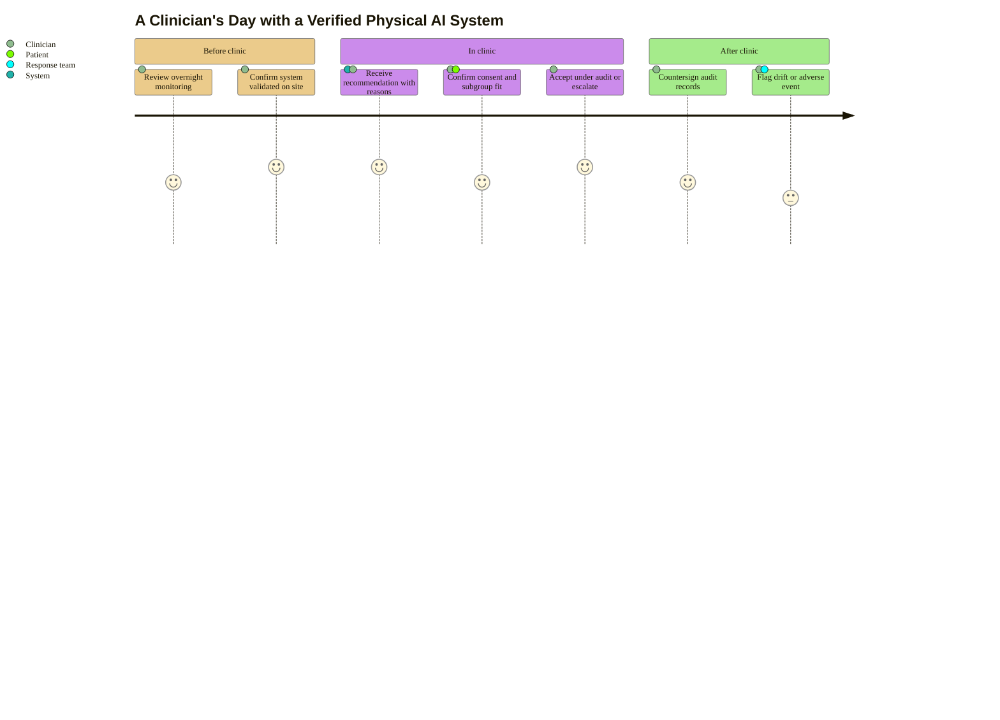

### 11. A Clinician's Day with the System

Workflow decides whether a safe tool is actually used: a clinician's day is scored
step by step, from reviewing overnight monitoring through accepting recommendations
under audit to countersigning records and flagging drift. A user journey is correct
because the content is an ordered lived experience with a satisfaction score per
step. Reproduced in the compiled LaTeX framework as a matching colored TikZ figure
(palette: black, grayscales, #EBCB8B, #D08770, #8B2E3F).

