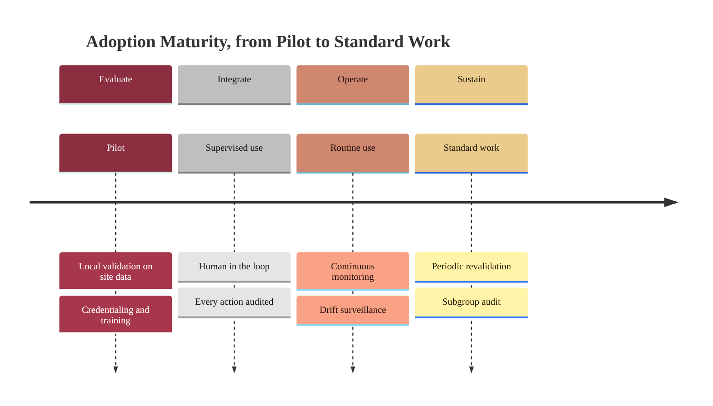

### 12. The Adoption Maturity Ladder

Adoption is a sequence of phases, not a switch: a site evaluates the system with
local validation and training, integrates it under supervision, operates it with
continuous monitoring, and sustains it with periodic revalidation. A timeline is
correct because the content is ordered into phases that advance over time.
Reproduced in the compiled LaTeX framework as a matching colored TikZ figure
(palette: black, grayscales, #EBCB8B, #D08770, #8B2E3F).

