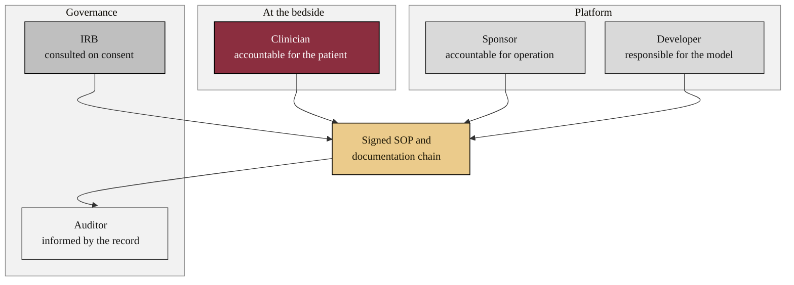

### 13. Where Accountability Sits

Accountability is unambiguous only when it is drawn: the clinician is accountable
for the patient, the sponsor for operation, the developer for the model, and the
IRB is consulted on consent, all converging on a signed standard operating
procedure that the auditor can read. A clustered flowchart is correct because it
groups distinct responsible parties that converge on one record. Reproduced in the
compiled LaTeX framework as a matching colored TikZ figure (palette: black,
grayscales, #EBCB8B, #D08770, #8B2E3F).

