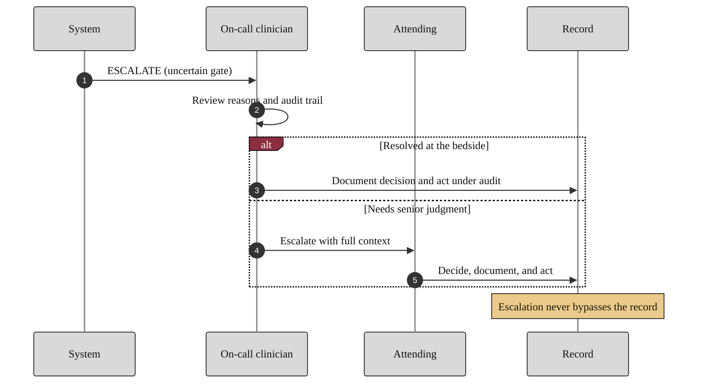

### 14. The Escalation Pathway

When a gate is uncertain the system does not guess: it escalates to the on-call
clinician, who resolves it at the bedside or escalates further to the attending,
and every step writes to the record. A sequence diagram with an alternative path is
correct because the content is an ordered exchange with a branch. Reproduced in the
compiled LaTeX framework as a matching colored TikZ figure (palette: black,
grayscales, #EBCB8B, #D08770, #8B2E3F).

