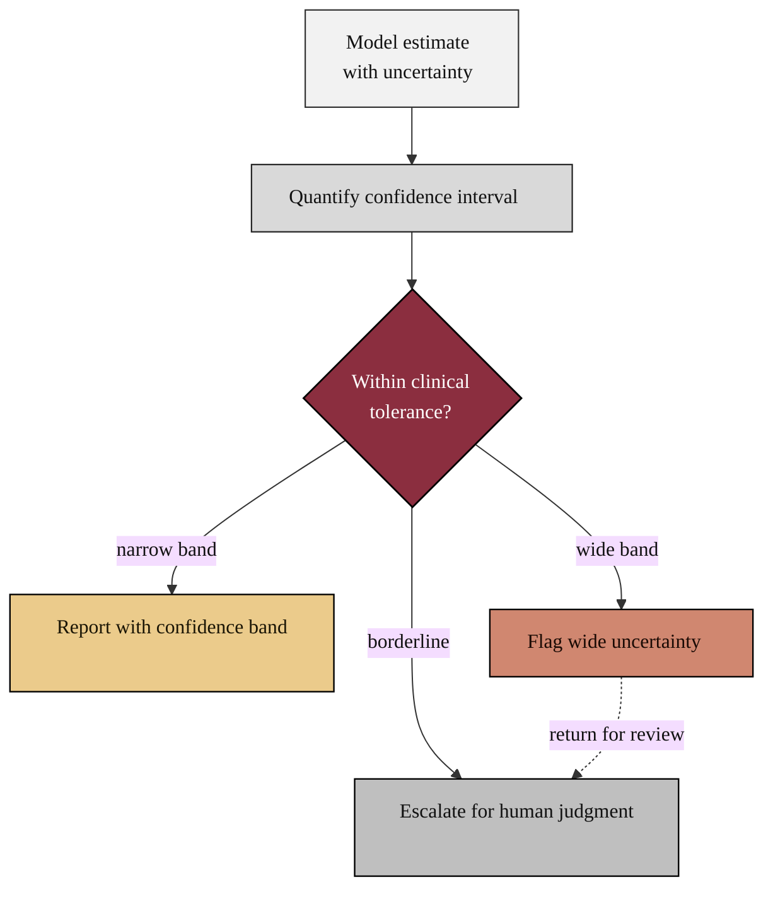

### 15. The Uncertainty Gate

Reliability includes honesty about doubt: every estimate carries a quantified
confidence interval, and an action proceeds only when that interval falls within
clinical tolerance, otherwise it is escalated or flagged. A flowchart is correct
because the content is a directed control flow with a guarded decision. Reproduced
in the compiled LaTeX framework as a matching colored TikZ figure (palette: black,
grayscales, #EBCB8B, #D08770, #8B2E3F).

