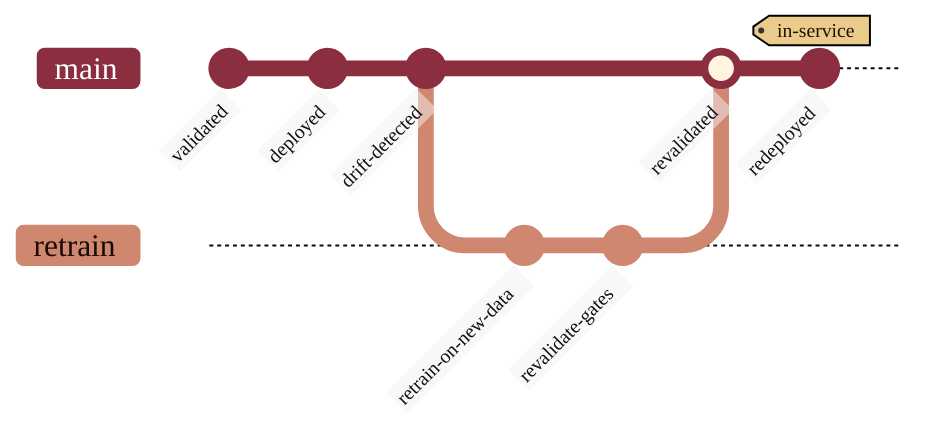

### 16. Model Revalidation Under Version Control

Reliability over time is managed like code: a validated model is deployed, drift is
detected, a branch retrains and revalidates against the gates, and only a passing
revalidation merges back and is redeployed in service. A version-control graph is
the most literal rendering of a branch that retrains and merges back into a single
line. Reproduced in the compiled LaTeX framework as a matching colored TikZ figure
(palette: black, grayscales, #EBCB8B, #D08770, #8B2E3F).

