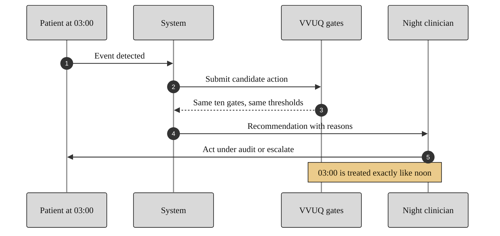

### 17. The Night-Shift Scenario

The hardest test of reliability is the one no one is watching: an event at 03:00 is
submitted to the same ten gates with the same thresholds as at noon, and the night
clinician receives the same reasoned recommendation. A sequence diagram is correct
because the content is an ordered, time-stamped exchange between parties.
Reproduced in the compiled LaTeX framework as a matching colored TikZ figure
(palette: black, grayscales, #EBCB8B, #D08770, #8B2E3F).

