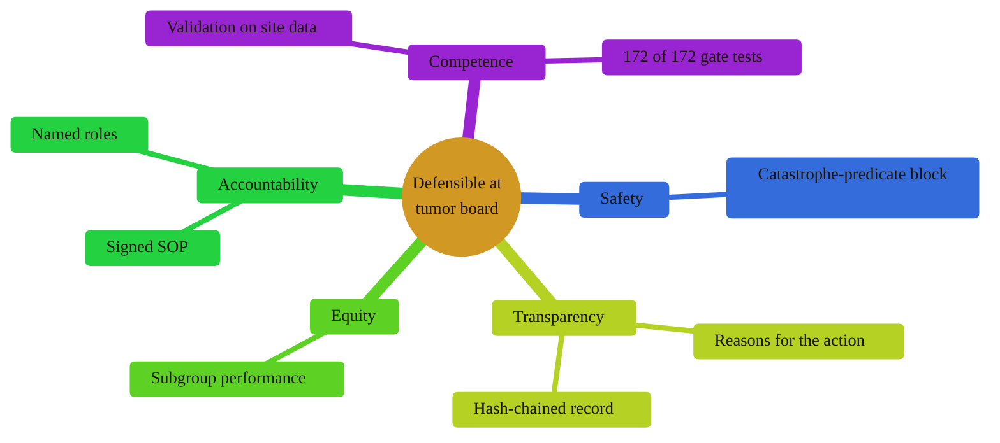

### 18. Defensible at Tumor Board

The framework's practical test is whether a clinician can defend a decision to
peers: the figure gathers what the clinician brings, validation, the safety block,
the reasons and record, subgroup performance, and the signed roles. A mindmap is
correct because the content is one central claim with parallel, non-sequential
supports. Reproduced in the compiled LaTeX framework as a matching colored TikZ
figure (palette: black, grayscales, #EBCB8B, #D08770, #8B2E3F).

