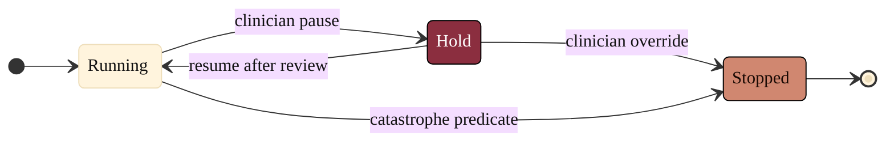

### 19. Override and the Stop Authority

Control means the clinician can always intervene: a running action can be paused
for review and resumed, or overridden to a full stop, and the catastrophe predicate
can stop it without any human in the path. A state diagram is correct because the
content is a small set of states with guarded transitions, including an
unconditional stop. Reproduced in the compiled LaTeX framework as a matching
colored TikZ figure (palette: black, grayscales, #EBCB8B, #D08770, #8B2E3F).

