### 20. From Bedside Confidence to Trial-Wide Trust

The capstone shows how one verified decision at the bedside scales: local
validation and a credentialed team make a site trustworthy, continuous monitoring
and subgroup audit make a trial trustworthy, and shared standards and a public
registry make the national platform trustworthy. A phase-grouped flowchart is
correct because it scales the model across connected levels while keeping the flow
fluent. Reproduced in the compiled LaTeX framework as a matching colored TikZ
figure (palette: black, grayscales, #EBCB8B, #D08770, #8B2E3F).

```mermaid
%%{init: {'theme':'base','themeVariables':{'fontFamily':'Helvetica, Arial, sans-serif','lineColor':'#333333','primaryTextColor':'#111111','clusterBkg':'#F2F2F2','clusterBorder':'#888888'},'flowchart':{'curve':'basis','nodeSpacing':26,'rankSpacing':44,'htmlLabels':true}}}%%
flowchart LR
  subgraph BED["Bedside"]
    direction TB
    D1["One verified decision"]:::n1
  end
  subgraph SITE["Site"]
    direction TB
    S1["Local validation"]:::n2
    S2["Credentialed team"]:::n2
  end
  subgraph TRIAL["Trial"]
    direction TB
    T1["Continuous monitoring"]:::act
    T2["Subgroup audit"]:::act
  end
  subgraph PLAT["National platform"]
    direction TB
    N1["Shared standards"]:::n3
    N2["Public registry"]:::hope
  end
  CT["Trial-wide<br/>calibrated trust"]:::act
  D1 --> S1 --> S2 --> T1 --> T2 --> N1 --> N2 --> CT
  classDef act fill:#8B2E3F,stroke:#000000,stroke-width:1.4px,color:#ffffff
  classDef hope fill:#EBCB8B,stroke:#000000,stroke-width:1.2px,color:#1A1505
  classDef n1 fill:#F2F2F2,stroke:#333333,stroke-width:1.1px,color:#111111
  classDef n2 fill:#D9D9D9,stroke:#222222,stroke-width:1.1px,color:#111111
  classDef n3 fill:#BFBFBF,stroke:#000000,stroke-width:1.2px,color:#111111
```

