## output-mermaid

# Colored Mermaid Catalog for the Clinician Confidence Framework

Twenty professional, colored Mermaid figures that illustrate the eight
confidence-question sections and the bedside adoption argument of the framework.
They are produced by sub-prompt 1 (`../sub-prompts/prompt-1-mermaid.md`) and are
adapted from the curated Mermaid families in the prior build (`../../review/mermaid/`),
re-themed to this clinician-facing project. This is a new paper topic and does not
rewrite the prior review.

Every figure uses the strict palette only: black, grayscales, and the three theme
colors `#EBCB8B` (gold, confidence and benefit), `#D08770` (clay, harm and risk),
and `#8B2E3F` (burgundy, verification, the gate, and clinician authority). The
`#8B2E3F` paper template theme is preserved. Each figure is reproduced in the
compiled LaTeX framework as a matching colored TikZ figure in the same palette, and
the figures are refined across the draft, full, and final stages.

### Palette

| Role | Fill | Text | Meaning |
|:--|:--|:--|:--|
| `act` | `#8B2E3F` | white | verification, the gate, clinician authority |
| `hope` | `#EBCB8B` | black | confidence, benefit, accepted outcome |
| `risk` | `#D08770` | black | harm, risk, the withheld or blocked action |
| `n1` | `#F2F2F2` | black | inputs, light structure |
| `n2` | `#D9D9D9` | black | process steps |
| `n3` | `#BFBFBF` | black | gates, emphasis structure |

### Index

| # | Title | Type | Confidence slot |
|:--|:--|:--|:--|
| 01 | The Bedside Trust Decision | flowchart | Framework |
| 02 | The Eight Confidence Questions | flowchart | Introduction |
| 03 | Verification Before Generation, the Clinician's View | flowchart | Framework |
| 04 | The Ten VVUQ Gates from the Clinician's Seat | flowchart | 2 Safety |
| 05 | The Calibrated-Trust Band | quadrant | Introduction |
| 06 | The Competence Evidence Stack | flowchart | 1 Competence |
| 07 | Safety Containment | flowchart | 2 Safety |
| 08 | The Audit Trail a Clinician Can Show | sequence | 3 Transparency |
| 09 | The Human-in-the-Loop Oversight Loop | state | 4 Oversight |
| 10 | The Subgroup Equity Map | quadrant | 5 Equity |
| 11 | A Clinician's Day with the System | journey | 8 Workflow |
| 12 | The Adoption Maturity Ladder | timeline | Framework |
| 13 | Where Accountability Sits | flowchart | 7 Accountability |
| 14 | The Escalation Pathway | sequence | 4 Oversight |
| 15 | The Uncertainty Gate | flowchart | 6 Reliability |
| 16 | Model Revalidation Under Version Control | gitGraph | 6 Reliability |
| 17 | The Night-Shift Scenario | sequence | 6 Reliability |
| 18 | Defensible at Tumor Board | mindmap | 3 Transparency |
| 19 | Override and the Stop Authority | state | 4 Oversight |
| 20 | From Bedside Confidence to Trial-Wide Trust | flowchart | Appendix capstone |

---

### 01. The Bedside Trust Decision

The core idea of the framework in one figure: when an autonomous system proposes
an action at the bedside, the clinician runs the eight confidence questions and
then relies on it under audit, escalates it to a qualified human, or withholds it
and documents why. A flowchart is correct because the content is a directed
control flow that ends in a single decision with three guarded outcomes.
Reproduced in the compiled LaTeX framework as a matching colored TikZ figure
(palette: black, grayscales, #EBCB8B, #D08770, #8B2E3F).

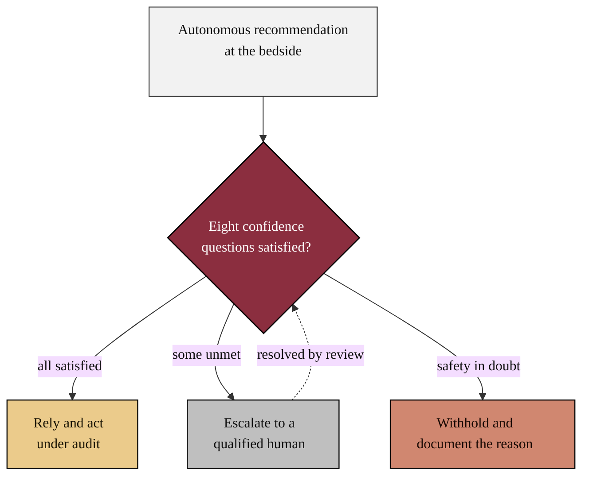

### 02. The Eight Confidence Questions

The framework's reading path: a clinician moves from the first question any tool
must answer, competence, through safety, transparency, oversight, equity,
reliability, and accountability, to the question that decides daily use, workflow,
and the answers together yield calibrated trust. A left-to-right flowchart is
correct because the content is an ordered reasoning path that converges on one
outcome. Reproduced in the compiled LaTeX framework as a matching colored TikZ
figure (palette: black, grayscales, #EBCB8B, #D08770, #8B2E3F).

```mermaid
%%{init: {'theme':'base','themeVariables':{'fontFamily':'Helvetica, Arial, sans-serif','lineColor':'#333333','primaryTextColor':'#111111'},'flowchart':{'curve':'natural','nodeSpacing':24,'rankSpacing':38,'htmlLabels':true}}}%%
flowchart LR
  Q1["1 Competence"]:::n1
  Q2["2 Safety"]:::risk
  Q3["3 Transparency"]:::n2
  Q4["4 Oversight"]:::n2
  Q5["5 Equity"]:::risk
  Q6["6 Reliability"]:::n3
  Q7["7 Accountability"]:::n2
  Q8["8 Workflow"]:::hope
  CT["Calibrated<br/>trust"]:::act
  Q1 --> Q2 --> Q3 --> Q4 --> Q5 --> Q6 --> Q7 --> Q8 --> CT
  classDef act fill:#8B2E3F,stroke:#000000,stroke-width:1.4px,color:#ffffff
  classDef hope fill:#EBCB8B,stroke:#000000,stroke-width:1.2px,color:#1A1505
  classDef risk fill:#D08770,stroke:#000000,stroke-width:1.2px,color:#1A0A04
  classDef n1 fill:#F2F2F2,stroke:#333333,stroke-width:1.1px,color:#111111
  classDef n2 fill:#D9D9D9,stroke:#222222,stroke-width:1.1px,color:#111111
  classDef n3 fill:#BFBFBF,stroke:#000000,stroke-width:1.2px,color:#111111
```

### 03. Verification Before Generation, the Clinician's View

The mechanism the framework rests on, seen from the clinician's seat: a clinical
question is posed, Claude Code proposes a candidate action, Codex reviews it
independently, and a ten-gate VVUQ check resolves to ACCEPT, ESCALATE to the
clinician, or BLOCK before anything reaches the patient. A flowchart is correct
because the content is a directed control flow with a decision node. Reproduced in
the compiled LaTeX framework as a matching colored TikZ figure (palette: black,
grayscales, #EBCB8B, #D08770, #8B2E3F).

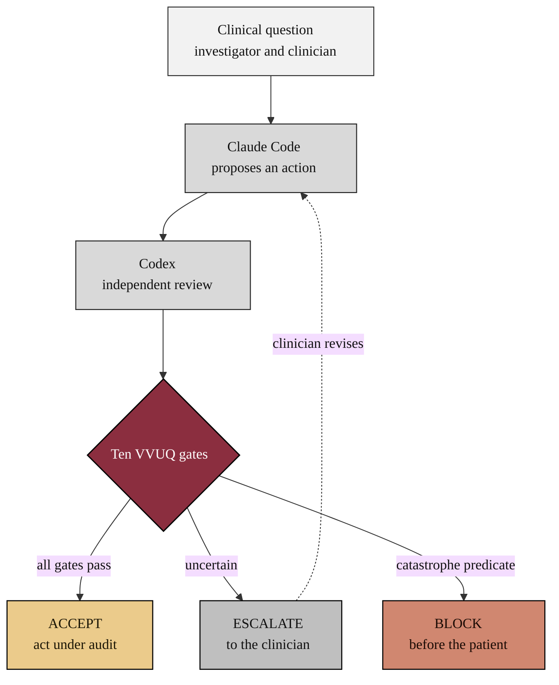

### 04. The Ten VVUQ Gates from the Clinician's Seat

Before any candidate action executes it descends through ten verification,
validation, and uncertainty-quantification gates, ending with a catastrophe
predicate that can hard-block. The clinician does not run the gates by hand, but
relies on the fact that all ten must pass. A vertical flowchart funnel is correct
because the content is a strict sequence of pass conditions that narrows to a
single accept. Reproduced in the compiled LaTeX framework as a matching colored
TikZ figure (palette: black, grayscales, #EBCB8B, #D08770, #8B2E3F).

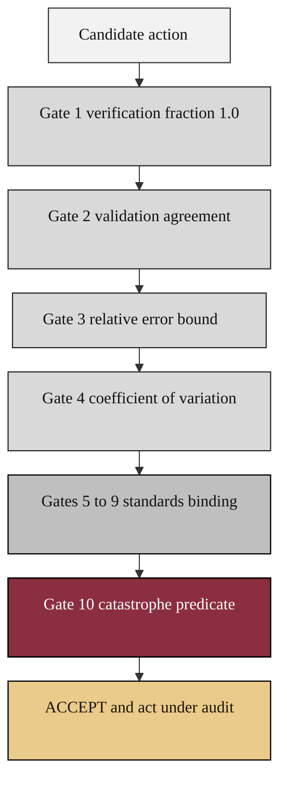

### 05. The Calibrated-Trust Band

The framework's organizing concept: a clinician should rely on a system exactly as
much as its demonstrated capability warrants. Plotting demonstrated capability
against clinician reliance separates calibrated trust from its two failure modes,
automation bias (over-trust) and algorithm aversion (under-trust). A quadrant chart
is correct because the content compares states on two continuous axes. Reproduced
in the compiled LaTeX framework as a matching colored TikZ figure (palette: black,
grayscales, #EBCB8B, #D08770, #8B2E3F).

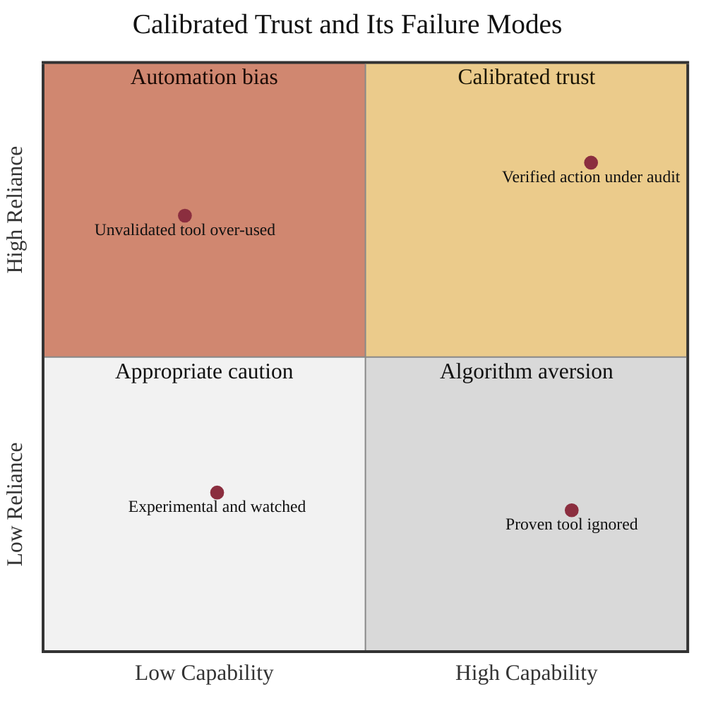

### 06. The Competence Evidence Stack

Competence is not one number but a stack of evidence built in order: bench
accuracy, a retrospective cohort, prospective validation on the site's own
patients, and the assurance run that passed every automated gate test. A
phase-grouped flowchart is correct because it shows independent evidence stages
that build to a single conclusion. Reproduced in the compiled LaTeX framework as a
matching colored TikZ figure (palette: black, grayscales, #EBCB8B, #D08770,
#8B2E3F).

```mermaid
%%{init: {'theme':'base','themeVariables':{'fontFamily':'Helvetica, Arial, sans-serif','lineColor':'#333333','primaryTextColor':'#111111','clusterBkg':'#F2F2F2','clusterBorder':'#888888'},'flowchart':{'curve':'basis','nodeSpacing':28,'rankSpacing':46,'htmlLabels':true}}}%%
flowchart LR
  subgraph BENCH["Bench"]
    B1["Benchmark accuracy"]:::n1
  end
  subgraph RETRO["Retrospective"]
    R1["Historical cohort agreement"]:::n2
  end
  subgraph PROSP["Prospective"]
    P1["Validation on site population"]:::n2
  end
  subgraph ASSURE["Assurance"]
    A1["172 of 172 gate tests"]:::act
  end
  CONF["Competence established"]:::hope
  B1 --> R1 --> P1 --> A1 --> CONF
  classDef act fill:#8B2E3F,stroke:#000000,stroke-width:1.4px,color:#ffffff
  classDef hope fill:#EBCB8B,stroke:#000000,stroke-width:1.2px,color:#1A1505
  classDef n1 fill:#F2F2F2,stroke:#333333,stroke-width:1.1px,color:#111111
  classDef n2 fill:#D9D9D9,stroke:#222222,stroke-width:1.1px,color:#111111
  classDef n3 fill:#BFBFBF,stroke:#000000,stroke-width:1.2px,color:#111111
```

### 07. Safety Containment

The safety case in motion: a candidate action or a detected adverse event is
classified, checked against the catastrophe-predicate gate, and then either
contained under audit, blocked before harm, or escalated to the response team. A
flowchart is correct because the content is a directed control flow with a guarded
decision. Reproduced in the compiled LaTeX framework as a matching colored TikZ
figure (palette: black, grayscales, #EBCB8B, #D08770, #8B2E3F).

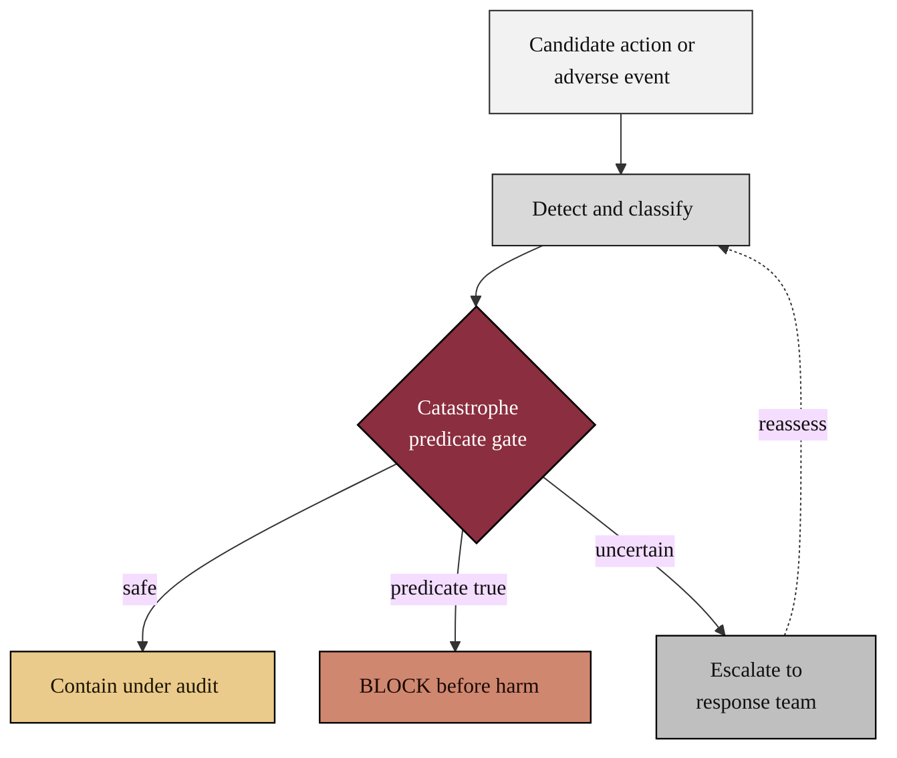

### 08. The Audit Trail a Clinician Can Show

Transparency is operational, not rhetorical: every action appends a hash-chained
record, the clinician countersigns the decision, and an auditor can later
reconstruct exactly what happened and why. A sequence diagram is correct because
the content is an ordered exchange of messages between named parties over time.
Reproduced in the compiled LaTeX framework as a matching colored TikZ figure
(palette: black, grayscales, #EBCB8B, #D08770, #8B2E3F).

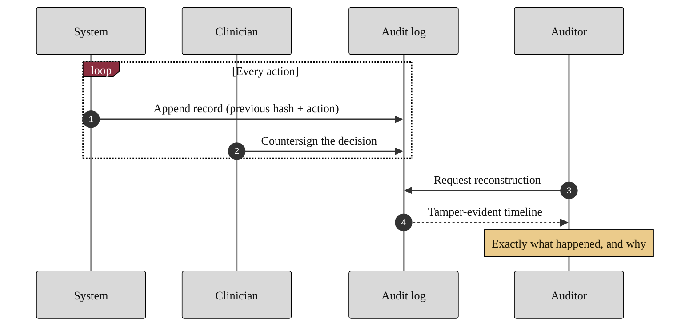

### 09. The Human-in-the-Loop Oversight Loop

Oversight is a loop the clinician never leaves: the system monitors, recommends,
and presents a decision the clinician accepts, escalates, or overrides, after
which control returns to monitoring. A state diagram is correct because the content
is a set of discrete states with guarded transitions and a choice. Reproduced in
the compiled LaTeX framework as a matching colored TikZ figure (palette: black,
grayscales, #EBCB8B, #D08770, #8B2E3F).

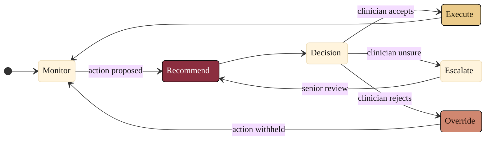

### 10. The Subgroup Equity Map

Equity is measured, not assumed: each clinically relevant subgroup is plotted by
its representation in validation against its performance relative to the overall
model, so disparities and under-sampled groups become surveillance priorities. A
quadrant chart is correct because the content compares subgroups on two continuous
axes. Reproduced in the compiled LaTeX framework as a matching colored TikZ figure
(palette: black, grayscales, #EBCB8B, #D08770, #8B2E3F).

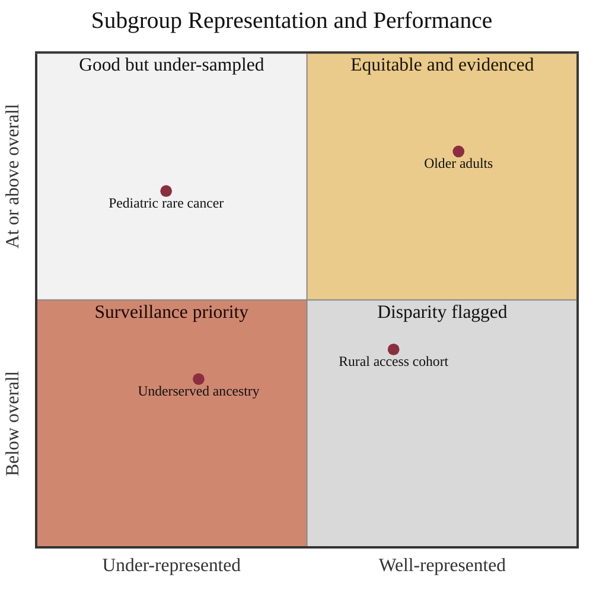

### 11. A Clinician's Day with the System

Workflow decides whether a safe tool is actually used: a clinician's day is scored
step by step, from reviewing overnight monitoring through accepting recommendations
under audit to countersigning records and flagging drift. A user journey is correct
because the content is an ordered lived experience with a satisfaction score per
step. Reproduced in the compiled LaTeX framework as a matching colored TikZ figure
(palette: black, grayscales, #EBCB8B, #D08770, #8B2E3F).

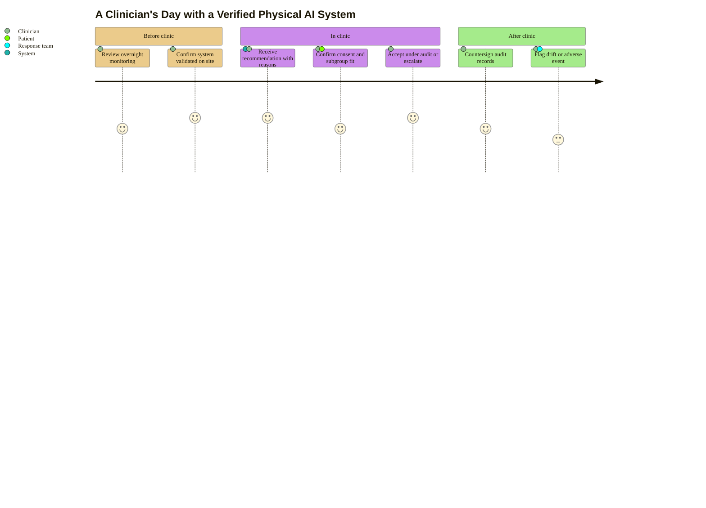

### 12. The Adoption Maturity Ladder

Adoption is a sequence of phases, not a switch: a site evaluates the system with
local validation and training, integrates it under supervision, operates it with
continuous monitoring, and sustains it with periodic revalidation. A timeline is
correct because the content is ordered into phases that advance over time.
Reproduced in the compiled LaTeX framework as a matching colored TikZ figure
(palette: black, grayscales, #EBCB8B, #D08770, #8B2E3F).

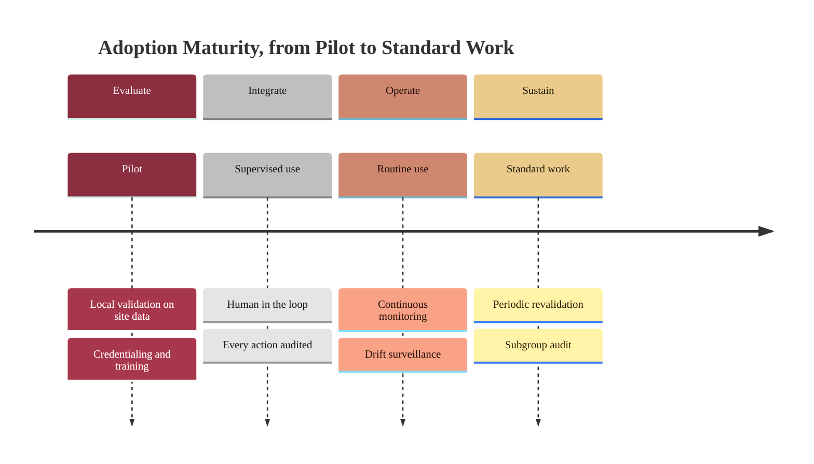

### 13. Where Accountability Sits

Accountability is unambiguous only when it is drawn: the clinician is accountable
for the patient, the sponsor for operation, the developer for the model, and the
IRB is consulted on consent, all converging on a signed standard operating
procedure that the auditor can read. A clustered flowchart is correct because it
groups distinct responsible parties that converge on one record. Reproduced in the
compiled LaTeX framework as a matching colored TikZ figure (palette: black,
grayscales, #EBCB8B, #D08770, #8B2E3F).

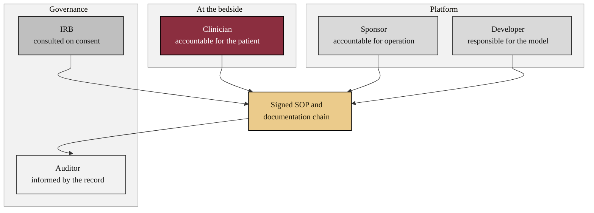

### 14. The Escalation Pathway

When a gate is uncertain the system does not guess: it escalates to the on-call
clinician, who resolves it at the bedside or escalates further to the attending,
and every step writes to the record. A sequence diagram with an alternative path is
correct because the content is an ordered exchange with a branch. Reproduced in the
compiled LaTeX framework as a matching colored TikZ figure (palette: black,
grayscales, #EBCB8B, #D08770, #8B2E3F).

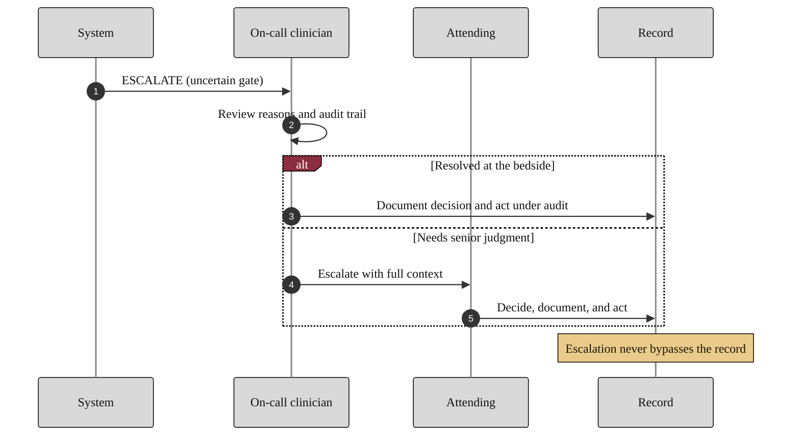

### 15. The Uncertainty Gate

Reliability includes honesty about doubt: every estimate carries a quantified
confidence interval, and an action proceeds only when that interval falls within
clinical tolerance, otherwise it is escalated or flagged. A flowchart is correct
because the content is a directed control flow with a guarded decision. Reproduced
in the compiled LaTeX framework as a matching colored TikZ figure (palette: black,
grayscales, #EBCB8B, #D08770, #8B2E3F).

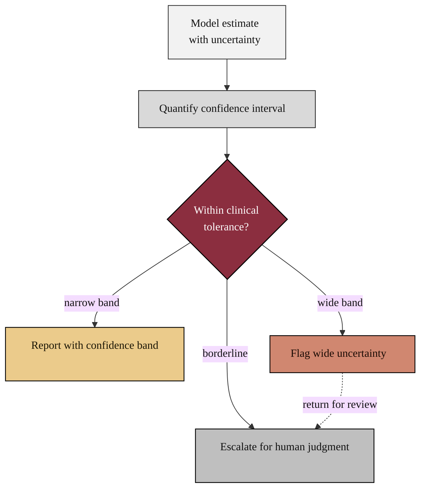

### 16. Model Revalidation Under Version Control

Reliability over time is managed like code: a validated model is deployed, drift is
detected, a branch retrains and revalidates against the gates, and only a passing
revalidation merges back and is redeployed in service. A version-control graph is
the most literal rendering of a branch that retrains and merges back into a single
line. Reproduced in the compiled LaTeX framework as a matching colored TikZ figure
(palette: black, grayscales, #EBCB8B, #D08770, #8B2E3F).

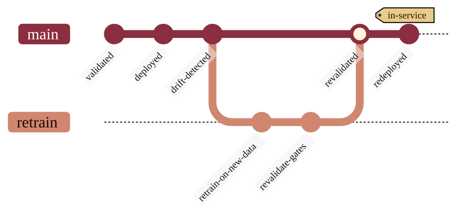

### 17. The Night-Shift Scenario

The hardest test of reliability is the one no one is watching: an event at 03:00 is
submitted to the same ten gates with the same thresholds as at noon, and the night
clinician receives the same reasoned recommendation. A sequence diagram is correct
because the content is an ordered, time-stamped exchange between parties.
Reproduced in the compiled LaTeX framework as a matching colored TikZ figure
(palette: black, grayscales, #EBCB8B, #D08770, #8B2E3F).

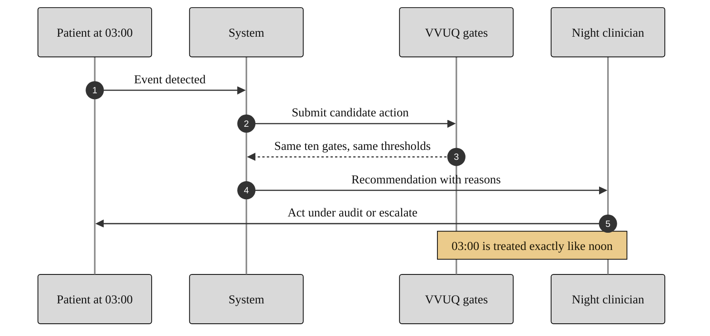

### 18. Defensible at Tumor Board

The framework's practical test is whether a clinician can defend a decision to
peers: the figure gathers what the clinician brings, validation, the safety block,
the reasons and record, subgroup performance, and the signed roles. A mindmap is
correct because the content is one central claim with parallel, non-sequential
supports. Reproduced in the compiled LaTeX framework as a matching colored TikZ
figure (palette: black, grayscales, #EBCB8B, #D08770, #8B2E3F).

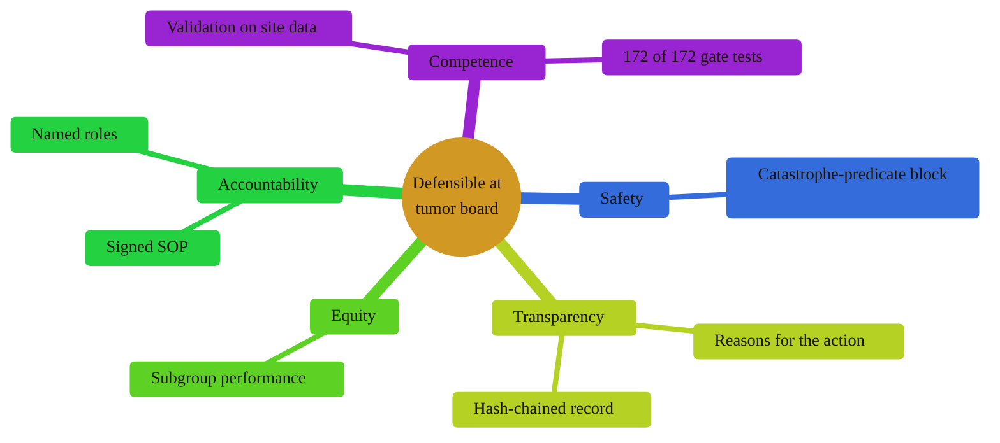

### 19. Override and the Stop Authority

Control means the clinician can always intervene: a running action can be paused
for review and resumed, or overridden to a full stop, and the catastrophe predicate
can stop it without any human in the path. A state diagram is correct because the
content is a small set of states with guarded transitions, including an
unconditional stop. Reproduced in the compiled LaTeX framework as a matching
colored TikZ figure (palette: black, grayscales, #EBCB8B, #D08770, #8B2E3F).

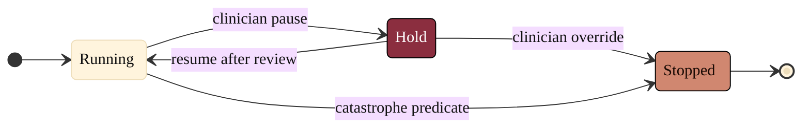

### 20. From Bedside Confidence to Trial-Wide Trust

The capstone shows how one verified decision at the bedside scales: local
validation and a credentialed team make a site trustworthy, continuous monitoring
and subgroup audit make a trial trustworthy, and shared standards and a public
registry make the national platform trustworthy. A phase-grouped flowchart is
correct because it scales the model across connected levels while keeping the flow
fluent. Reproduced in the compiled LaTeX framework as a matching colored TikZ
figure (palette: black, grayscales, #EBCB8B, #D08770, #8B2E3F).

```mermaid
%%{init: {'theme':'base','themeVariables':{'fontFamily':'Helvetica, Arial, sans-serif','lineColor':'#333333','primaryTextColor':'#111111','clusterBkg':'#F2F2F2','clusterBorder':'#888888'},'flowchart':{'curve':'basis','nodeSpacing':26,'rankSpacing':44,'htmlLabels':true}}}%%
flowchart LR
  subgraph BED["Bedside"]
    direction TB
    D1["One verified decision"]:::n1
  end
  subgraph SITE["Site"]
    direction TB
    S1["Local validation"]:::n2
    S2["Credentialed team"]:::n2
  end
  subgraph TRIAL["Trial"]
    direction TB
    T1["Continuous monitoring"]:::act
    T2["Subgroup audit"]:::act
  end
  subgraph PLAT["National platform"]
    direction TB
    N1["Shared standards"]:::n3
    N2["Public registry"]:::hope
  end
  CT["Trial-wide<br/>calibrated trust"]:::act
  D1 --> S1 --> S2 --> T1 --> T2 --> N1 --> N2 --> CT
  classDef act fill:#8B2E3F,stroke:#000000,stroke-width:1.4px,color:#ffffff
  classDef hope fill:#EBCB8B,stroke:#000000,stroke-width:1.2px,color:#1A1505
  classDef n1 fill:#F2F2F2,stroke:#333333,stroke-width:1.1px,color:#111111
  classDef n2 fill:#D9D9D9,stroke:#222222,stroke-width:1.1px,color:#111111
  classDef n3 fill:#BFBFBF,stroke:#000000,stroke-width:1.2px,color:#111111
```

