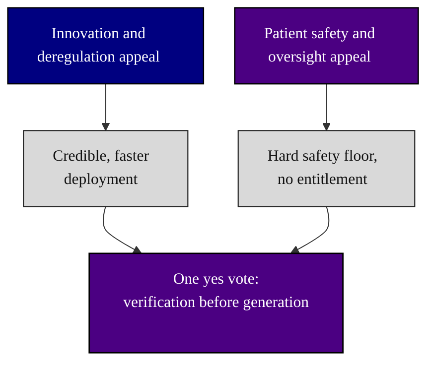

# mermaid - Stage 1: the colored figure catalog (v0.3.0)

[](https://creativecommons.org/licenses/by/4.0/)
[](diagrams/)
[](diagrams/)
[](.)

This directory is the output of **Stage 1** (sub-prompt
[`../sub-prompts/prompt-1-mermaid.md`](../sub-prompts/prompt-1-mermaid.md)): 20
high-quality, professional Mermaid figures that illustrate the eight passage
questions and the bipartisan-passage argument for H. R. 9510. Each figure lives in
its own file under [`diagrams/`](diagrams/) and is embedded for GitHub rendering in
[`output-mermaid.md`](output-mermaid.md). Each is reproduced in the compiled LaTeX
manuscript as a matching colored TikZ figure and refined across the draft, full,
verify, and final stages.

## Palette (strict)

Only black, grayscales, and three theme colors are used:

| Swatch | Hex | Role |
|:--|:--|:--|
| Indigo | `#4B0082` | Authority, the bill, the chamber action (also the paper template color) |
| Navy | `#000080` | Evidence and support |
| Silver | `#C0C0C0` | Cost and caution |
| Grays | `#F2F2F2` / `#D9D9D9` / `#BFBFBF` | Inputs, steps, and boundaries |

## Diagram types (nine distinct families)

flowchart, journey, timeline, quadrantChart, sankey, block, mindmap,
sequenceDiagram, gitGraph, requirementDiagram, and stateDiagram are each used for
the content they fit best, so no two figures repeat the same pattern unnecessarily.

## Representative figure



## Table of contents

```
mermaid/
  README.md            (this file)
  output-mermaid.md    (catalog: all 20 figures embedded for GitHub)
  diagrams/
    01-passage-decision.md              11-constituent-reach.md
    02-eight-passage-questions.md       12-bipartisan-convergence.md
    03-verification-before-generation.md 13-coalition-mindmap.md
    04-ten-vvuq-gates.md                14-platform-proof.md
    05-amendment-map.md                 15-senate-companion-sequence.md
    06-legislative-journey.md           16-markup-gitgraph.md
    07-fiscal-picture.md                17-vote-thresholds-requirements.md
    08-cost-asymmetry-quadrant.md       18-objection-handling-flow.md
    09-federalism-savings-clause.md     19-paygo-scoring-state.md
    10-standards-basis.md               20-one-yes-to-enactment-capstone.md
```

## Sources used from other directories (Rule 6)

| Asset used | Upstream source | Used in |
|:--|:--|:--|
| Colored Mermaid families, classDef discipline, init config | [`adoption/mermaid/`](../../adoption/mermaid/) | every diagram |
| Bill mechanism and section names (515D, ten gates, amendments) | `single-prompt-bill/auto-bill-02/final-bill/publication` | figures 03, 04, 05, 09, 10 |
| Platform evidence (168 patients, 99.7 percent uptime) | `physical-ai-oncology-trials/national-platform/new_paper/final_paper` | figures 11, 14 |

## License

Released under CC BY 4.0. Author: Kevin Kawchak, CEO ChemicalQDevice
([ORCID 0009-0007-5457-8667](https://orcid.org/0009-0007-5457-8667)).
