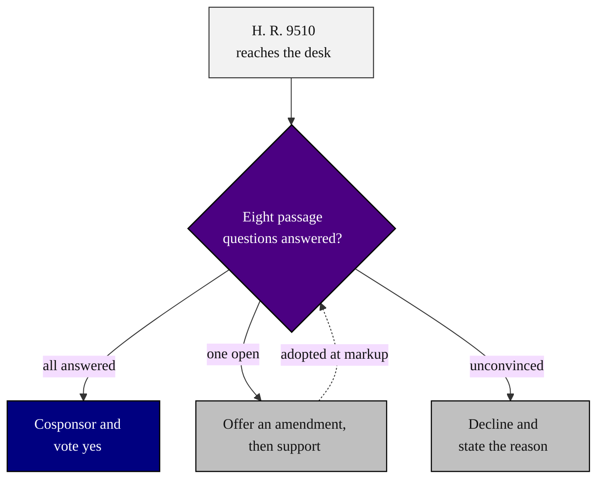

### 01. The Passage Decision

The core idea of the framework in one figure: when H. R. 9510 reaches a member's
desk, the member runs the eight passage questions and then cosponsors and votes
yes, offers an amendment first, or declines and states the reason. A flowchart is
correct because the content is a directed decision flow that ends in one choice
with three guarded outcomes. Reproduced in the compiled LaTeX framework as a
matching colored TikZ figure (palette: black, grayscales, #4B0082, #000080,
#C0C0C0).

