### 02. The Eight Passage Questions

The framework's spine: a legislator's reasoning path runs from the mandate for a
statute through authority, safety, fiscal score, constituents, bipartisanship, and
coalition to the passage path itself. A left-to-right flowchart is correct because
the eight questions are an ordered argument, each building on the answer before it.
Reproduced in the compiled LaTeX framework as a matching colored TikZ figure
(palette: black, grayscales, #4B0082, #000080, #C0C0C0).

```mermaid
%%{init: {'theme':'base','themeVariables':{'fontFamily':'Helvetica, Arial, sans-serif','lineColor':'#333333','primaryTextColor':'#111111'},'flowchart':{'curve':'natural','nodeSpacing':26,'rankSpacing':40,'htmlLabels':true}}}%%
flowchart LR
  Q1["1 Mandate"]:::n1 --> Q2["2 Authority"]:::n2
  Q2 --> Q3["3 Safety"]:::act
  Q3 --> Q4["4 Fiscal"]:::n3
  Q4 --> Q5["5 Constituents"]:::n2
  Q5 --> Q6["6 Bipartisanship"]:::evid
  Q6 --> Q7["7 Coalition"]:::n3
  Q7 --> Q8["8 Passage path"]:::act
  Q8 --> OUT["A yes vote in<br/>both chambers"]:::evid
  classDef act fill:#4B0082,stroke:#000000,stroke-width:1.4px,color:#ffffff
  classDef evid fill:#000080,stroke:#000000,stroke-width:1.3px,color:#ffffff
  classDef caut fill:#C0C0C0,stroke:#000000,stroke-width:1.2px,color:#111111
  classDef n1 fill:#F2F2F2,stroke:#333333,stroke-width:1.1px,color:#111111
  classDef n2 fill:#D9D9D9,stroke:#222222,stroke-width:1.1px,color:#111111
  classDef n3 fill:#BFBFBF,stroke:#000000,stroke-width:1.2px,color:#111111
```

