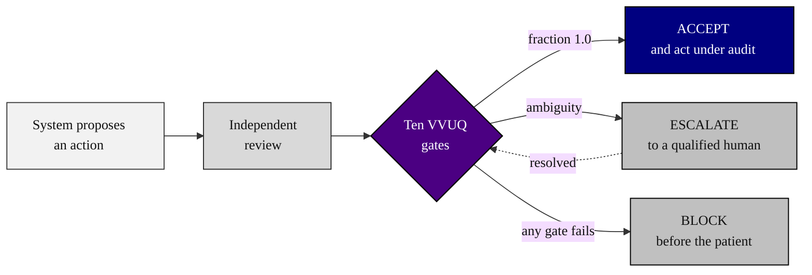

### 03. Verification Before Generation, the Legislator's View

The mechanism the bill actually codifies: before any robot-patient interaction code
is generated or executed, a system proposes the action, an independent reviewer
checks it, and a ten-gate examination resolves it to ACCEPT under audit, ESCALATE to
a qualified human, or BLOCK before the patient. A left-to-right flowchart is correct
because this is a pipeline with one gated branch. Reproduced in the compiled LaTeX
framework as a matching colored TikZ figure (palette: black, grayscales, #4B0082,
#000080, #C0C0C0).

