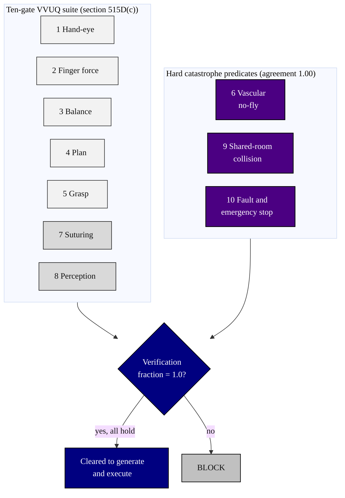

### 04. The Ten Gates Congress Is Enacting

The regulatory content of section 515D: ten verification gates, each bound to a
published external standard, with three hard catastrophe predicates (vascular
no-fly, shared-room collision, and fault or emergency stop) that must hold without
exception. A top-down flowchart is correct because it shows a fixed schedule
converging on the predicates that can stop everything. Reproduced in the compiled
LaTeX framework as a matching colored TikZ figure (palette: black, grayscales,
#4B0082, #000080, #C0C0C0).

