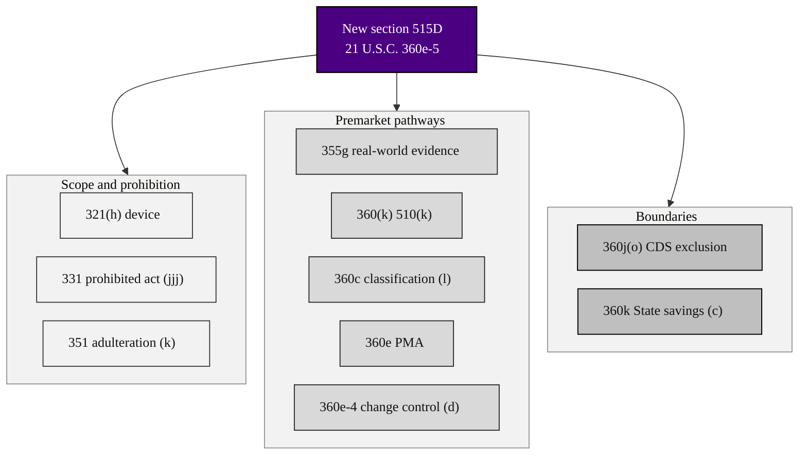

### 05. The Amendment Map

What the bill changes in the United States Code: a single new section 515D
(21 U.S.C. 360e-5) carries ten conforming amendments across Title 21, from the
device definition to State preemption, plus a clerical update to the table of
contents. A clustered flowchart is correct because one new section radiates targeted
edits into existing law. Reproduced in the compiled LaTeX framework as a matching
colored TikZ figure (palette: black, grayscales, #4B0082, #000080, #C0C0C0).

