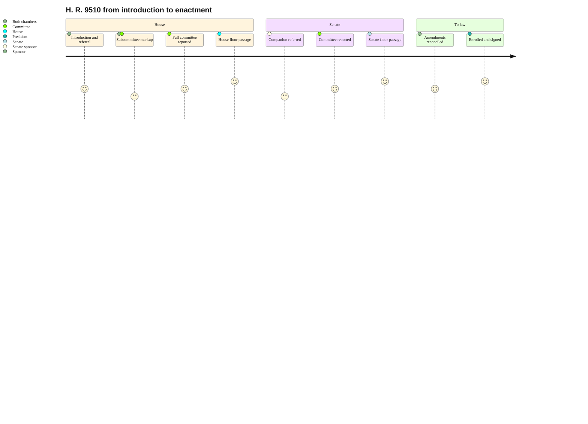

### 06. The Legislative Journey

The path the bill must travel: introduction and referral, subcommittee and full
committee markup, House floor passage, the same sequence in the Senate, conference
or amendment exchange, and finally enrollment and signature. A journey diagram is
correct because it scores each stage as a sentiment the sponsor must manage, not
just a box to clear. Reproduced in the compiled LaTeX framework as a matching
colored TikZ figure (palette: black, grayscales, #4B0082, #000080, #C0C0C0).

