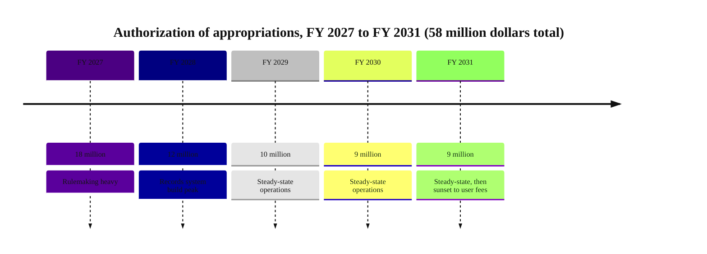

### 07. The Fiscal Picture

What the bill authorizes and when: a declining authorization from 18 million dollars
in FY 2027 to 9 million dollars in FY 2031, 58 million dollars in all, with outlays
of 53.5 million dollars inside the window and no new mandatory spending. A timeline
is correct because the fiscal story is a dated, multi-year schedule a scorekeeper
reads year by year. Reproduced in the compiled LaTeX framework as a matching colored
TikZ figure (palette: black, grayscales, #4B0082, #000080, #C0C0C0).

