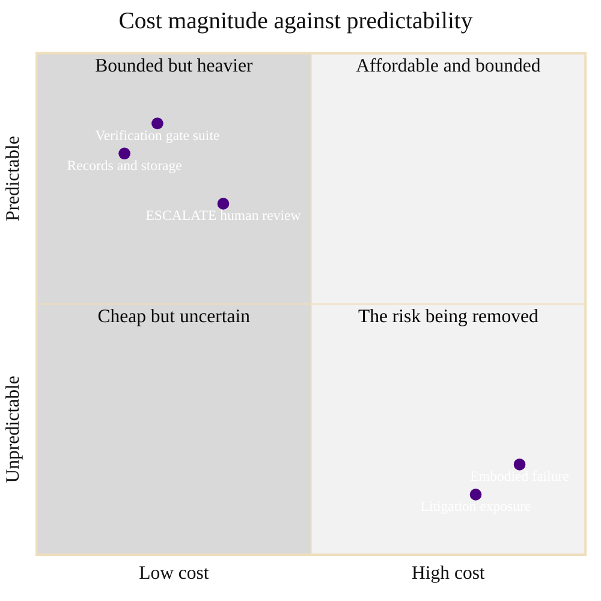

### 08. The Cost Asymmetry

The argument that disarms the fiscal objection: the verification gate is priced in
compute, storage, and bounded human review (small, fixed, measurable), while the
embodied failure it prevents is priced in lives and litigation (large, unbounded). A
quadrant chart is correct because it places each item on the two axes that matter to
a scorekeeper, cost magnitude and predictability. Reproduced in the compiled LaTeX
framework as a matching colored TikZ figure (palette: black, grayscales, #4B0082,
#000080, #C0C0C0).

