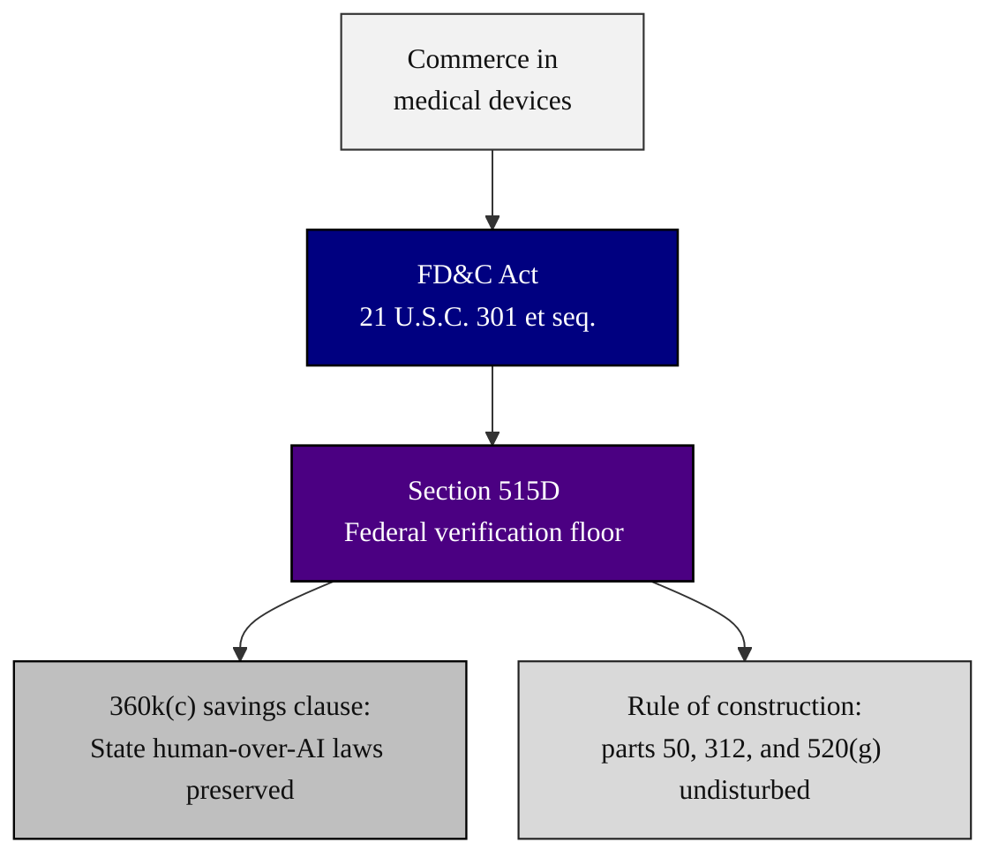

### 09. Authority and the State Savings Clause

Why the bill is within Congress's power and respectful of the States: it acts on
interstate commerce in medical devices through the Federal Food, Drug, and Cosmetic
Act, sets a Federal floor in section 515D, and preserves State laws that require a
licensed human to monitor or override the system through a savings clause in section
360k(c). A top-down flowchart is correct because authority flows from a source to a
floor and then carves out what it does not displace. Reproduced in the compiled
LaTeX framework as a matching colored TikZ figure (palette: black, grayscales,
#4B0082, #000080, #C0C0C0).

