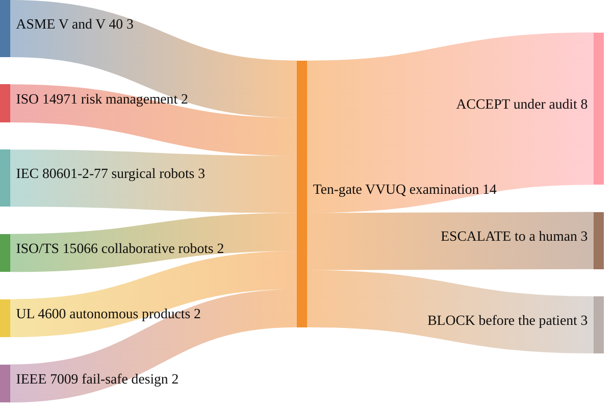

### 10. The Recognized Standards Basis

The bill does not invent its rigor; each gate is bound to a published consensus
standard, so the verification floor rests on work the relevant professions already
trust. A sankey diagram is correct because it shows several recognized standards
flowing into the one ten-gate examination the statute requires. Reproduced in the
compiled LaTeX framework as a matching colored TikZ figure (palette: black,
grayscales, #4B0082, #000080, #C0C0C0).

