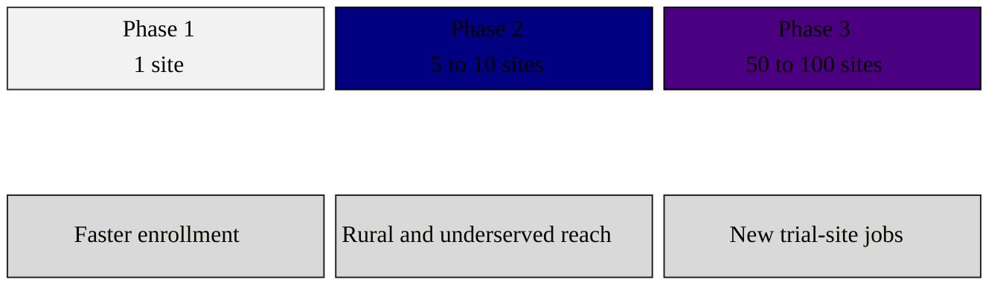

### 11. Constituent Reach

Why a member in any State has a stake: the platform's rollout grows from a single
site to fifty through one hundred operational sites across all major regions, so the
bill that enables it touches rural and urban districts alike. A block diagram is
correct because the content is a staged grid of capacity that a member reads against
their own district. Reproduced in the compiled LaTeX framework as a matching colored
TikZ figure (palette: black, grayscales, #4B0082, #000080, #C0C0C0).

