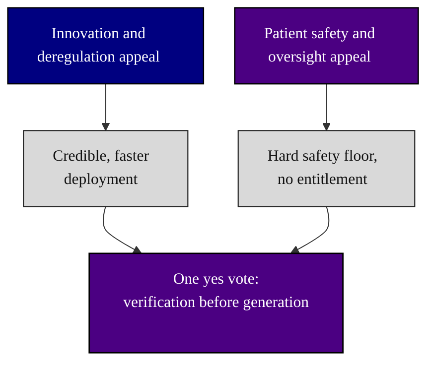

### 12. Where the Two Caucuses Converge

The bipartisan case in one figure: an innovation-and-deregulation appeal and a
patient-safety-and-oversight appeal start from different premises but converge on the
same vote, because verification before generation both speeds credible deployment
and sets a hard safety floor. A converging flowchart is correct because it shows two
distinct motivations meeting at one outcome. Reproduced in the compiled LaTeX
framework as a matching colored TikZ figure (palette: black, grayscales, #4B0082,
#000080, #C0C0C0).

