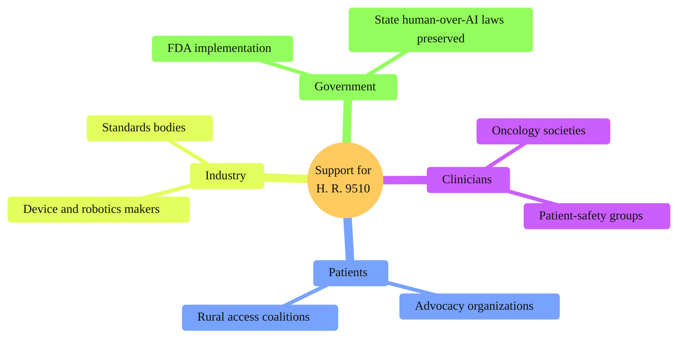

### 13. The Supporting Coalition

Who stands behind the bill and why no organized opponent is evident: medical
societies, patient advocates, industry and standards bodies, and the States each find
something to support, from a clear safety floor to predictable rules of the road. A
mindmap is correct because it radiates one center (support for H. R. 9510) into the
distinct stakeholder groups that compose a coalition. Reproduced in the compiled
LaTeX framework as a matching colored TikZ figure (palette: black, grayscales,
#4B0082, #000080, #C0C0C0).

