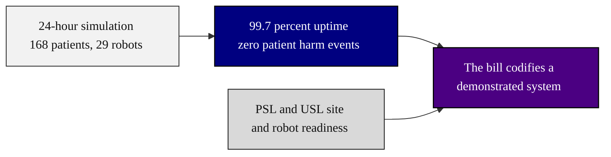

### 14. The Platform as Proof of Implementability

The answer to "can this actually be done": the National Platform's validated
simulation treated 168 patients with 29 robots across 15 cancer types at 99.7
percent uptime with zero patient harm events, which turns the bill from an
aspiration into a codification of something already shown to work. A left-to-right
flowchart is correct because it traces evidence into a conclusion a member can cite.
Reproduced in the compiled LaTeX framework as a matching colored TikZ figure
(palette: black, grayscales, #4B0082, #000080, #C0C0C0).

