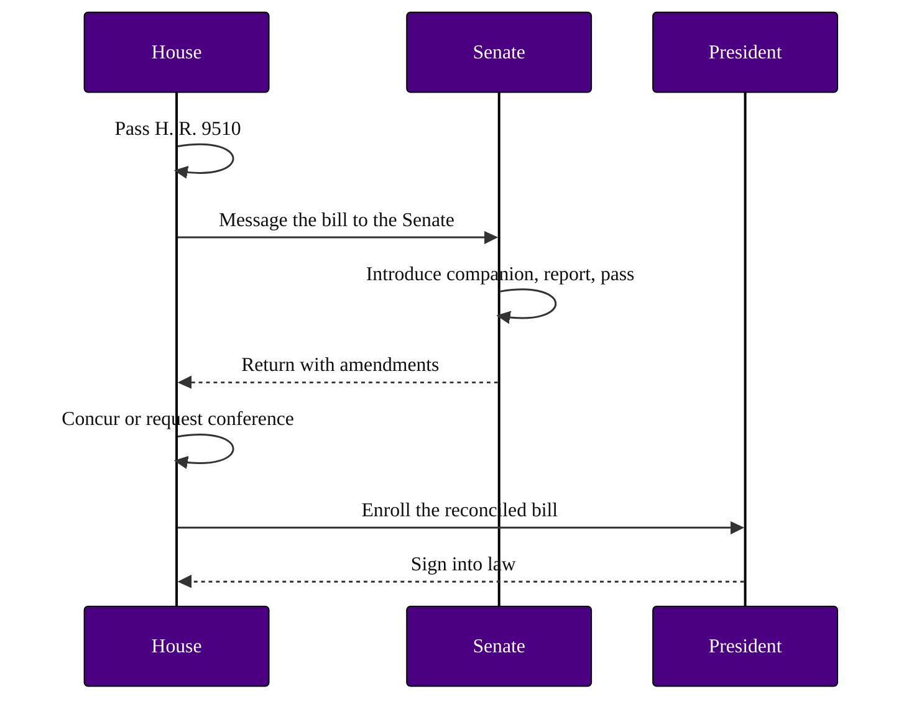

### 15. The Two-Chamber Strategy

How passage in one chamber is converted into law: a Senate companion is introduced
in parallel, each chamber reports and passes its version, and the differences are
reconciled by amendment exchange or conference before enrollment. A sequence diagram
is correct because the content is an ordered exchange of messages between two
chambers over time. Reproduced in the compiled LaTeX framework as a matching colored
TikZ figure (palette: black, grayscales, #4B0082, #000080, #C0C0C0).

