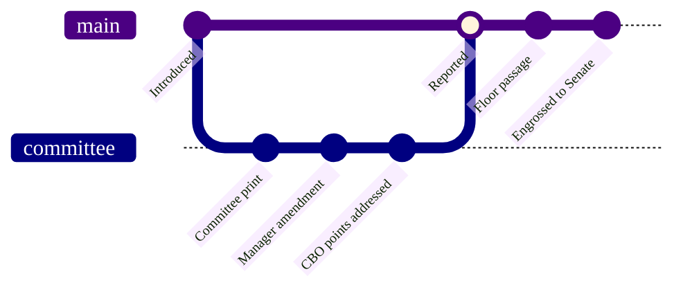

### 16. The Markup Lifecycle

How a bill is improved without being lost: it is introduced, a committee print and a
manager's amendment refine it on a working branch, and the refined text merges back
as the reported bill that goes to the floor. A gitGraph is correct because markup is
literally a branch-and-merge of legislative text. Reproduced in the compiled LaTeX
framework as a matching colored TikZ figure (palette: black, grayscales, #4B0082,
#000080, #C0C0C0).

