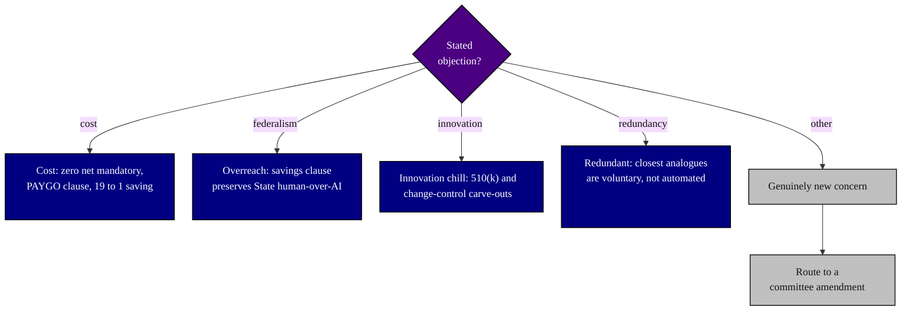

### 18. Handling the Standard Objections

How each predictable objection is answered rather than avoided: a stated objection
(cost, federal overreach, innovation chill, or redundancy) is met with the specific
cited provision that resolves it, and only a genuinely new concern is routed to an
amendment. A flowchart is correct because objection handling is a routed decision
that mostly terminates in a citation. Reproduced in the compiled LaTeX framework as a
matching colored TikZ figure (palette: black, grayscales, #4B0082, #000080,
#C0C0C0).

