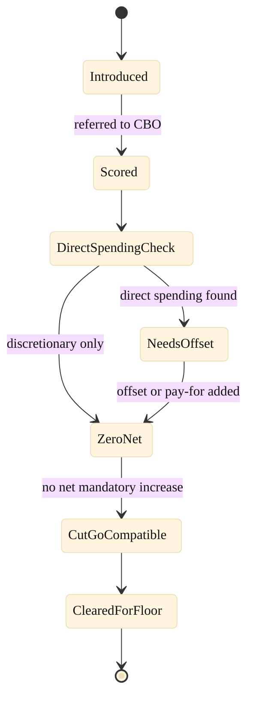

### 19. The Scoring Path

How the bill clears the budget points of order: once introduced it is scored, the
authorization is found to create no direct spending and no revenue effect, the PAYGO
scorecard reads zero, and the bill is CutGo compatible and cleared for the floor. A
state diagram is correct because scorekeeping is a sequence of states with one guard
that could send a bill back for an offset. Reproduced in the compiled LaTeX
framework as a matching colored TikZ figure (palette: black, grayscales, #4B0082,
#000080, #C0C0C0).

