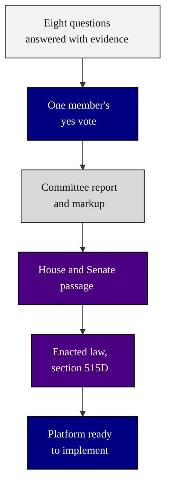

### 20. From One Yes to Enactment

The capstone: the eight answered questions become one member's yes, that yes becomes
a committee report, the report becomes House and Senate passage, and the two
chambers become enacted law that the platform is ready to implement. A top-down
flowchart is correct because it closes the framework by tracing a single decision up
to the statute it produces. Reproduced in the compiled LaTeX framework as a matching
colored TikZ figure (palette: black, grayscales, #4B0082, #000080, #C0C0C0).

