## output-mermaid

The curated colored Mermaid set for the H. R. 9510 passage framework: 20
professional figures in the strict palette black, grayscales, #4B0082 (indigo,
authority and the bill), #000080 (navy, evidence and support), and #C0C0C0 (silver,
cost and caution). Each figure below renders natively on GitHub and is reproduced in
the compiled LaTeX manuscript as a matching colored TikZ figure across the draft,
full, verify, and final stages. No raster image is used.

### Catalog

| # | Title | Type | Framework slot |
|:--|:--|:--|:--|
| 01 | The Passage Decision | flowchart | Introduction / framework |
| 02 | The Eight Passage Questions | flowchart | Framework spine |
| 03 | Verification Before Generation | flowchart | Q3 Safety |
| 04 | The Ten Gates Congress Is Enacting | flowchart | Q3 Safety |
| 05 | The Amendment Map | flowchart | Q2 Authority |
| 06 | The Legislative Journey | journey | Q8 Passage path |
| 07 | The Fiscal Picture | timeline | Q4 Fiscal |
| 08 | The Cost Asymmetry | quadrant | Q4 Fiscal |
| 09 | Authority and the State Savings Clause | flowchart | Q2 Authority |
| 10 | The Recognized Standards Basis | sankey | Q3 Safety / Q2 Authority |
| 11 | Constituent Reach | block | Q5 Constituents |
| 12 | Where the Two Caucuses Converge | flowchart | Q6 Bipartisanship |
| 13 | The Supporting Coalition | mindmap | Q7 Coalition |
| 14 | The Platform as Proof of Implementability | flowchart | Q1 Mandate / Q5 |
| 15 | The Two-Chamber Strategy | sequence | Q8 Passage path |
| 16 | The Markup Lifecycle | gitGraph | Q8 Passage path |
| 17 | The Vote Thresholds | requirement | Q8 Passage path |
| 18 | Handling the Standard Objections | flowchart | Q6 / Q7 |
| 19 | The Scoring Path | state | Q4 Fiscal |
| 20 | From One Yes to Enactment | flowchart | Capstone |

---

### 01. The Passage Decision

The core idea of the framework in one figure: when H. R. 9510 reaches a member's
desk, the member runs the eight passage questions and then cosponsors and votes
yes, offers an amendment first, or declines and states the reason. A flowchart is
correct because the content is a directed decision flow that ends in one choice
with three guarded outcomes. Reproduced in the compiled LaTeX framework as a
matching colored TikZ figure (palette: black, grayscales, #4B0082, #000080,
#C0C0C0).

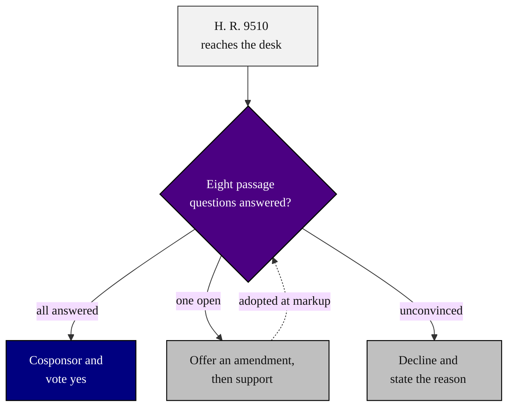


---

### 02. The Eight Passage Questions

The framework's spine: a legislator's reasoning path runs from the mandate for a
statute through authority, safety, fiscal score, constituents, bipartisanship, and
coalition to the passage path itself. A left-to-right flowchart is correct because
the eight questions are an ordered argument, each building on the answer before it.
Reproduced in the compiled LaTeX framework as a matching colored TikZ figure
(palette: black, grayscales, #4B0082, #000080, #C0C0C0).

```mermaid
%%{init: {'theme':'base','themeVariables':{'fontFamily':'Helvetica, Arial, sans-serif','lineColor':'#333333','primaryTextColor':'#111111'},'flowchart':{'curve':'natural','nodeSpacing':26,'rankSpacing':40,'htmlLabels':true}}}%%
flowchart LR
  Q1["1 Mandate"]:::n1 --> Q2["2 Authority"]:::n2
  Q2 --> Q3["3 Safety"]:::act
  Q3 --> Q4["4 Fiscal"]:::n3
  Q4 --> Q5["5 Constituents"]:::n2
  Q5 --> Q6["6 Bipartisanship"]:::evid
  Q6 --> Q7["7 Coalition"]:::n3
  Q7 --> Q8["8 Passage path"]:::act
  Q8 --> OUT["A yes vote in<br/>both chambers"]:::evid
  classDef act fill:#4B0082,stroke:#000000,stroke-width:1.4px,color:#ffffff
  classDef evid fill:#000080,stroke:#000000,stroke-width:1.3px,color:#ffffff
  classDef caut fill:#C0C0C0,stroke:#000000,stroke-width:1.2px,color:#111111
  classDef n1 fill:#F2F2F2,stroke:#333333,stroke-width:1.1px,color:#111111
  classDef n2 fill:#D9D9D9,stroke:#222222,stroke-width:1.1px,color:#111111
  classDef n3 fill:#BFBFBF,stroke:#000000,stroke-width:1.2px,color:#111111
```


---

### 03. Verification Before Generation, the Legislator's View

The mechanism the bill actually codifies: before any robot-patient interaction code
is generated or executed, a system proposes the action, an independent reviewer
checks it, and a ten-gate examination resolves it to ACCEPT under audit, ESCALATE to
a qualified human, or BLOCK before the patient. A left-to-right flowchart is correct
because this is a pipeline with one gated branch. Reproduced in the compiled LaTeX
framework as a matching colored TikZ figure (palette: black, grayscales, #4B0082,
#000080, #C0C0C0).

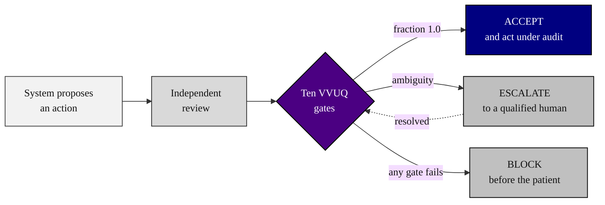


---

### 04. The Ten Gates Congress Is Enacting

The regulatory content of section 515D: ten verification gates, each bound to a
published external standard, with three hard catastrophe predicates (vascular
no-fly, shared-room collision, and fault or emergency stop) that must hold without
exception. A top-down flowchart is correct because it shows a fixed schedule
converging on the predicates that can stop everything. Reproduced in the compiled
LaTeX framework as a matching colored TikZ figure (palette: black, grayscales,
#4B0082, #000080, #C0C0C0).

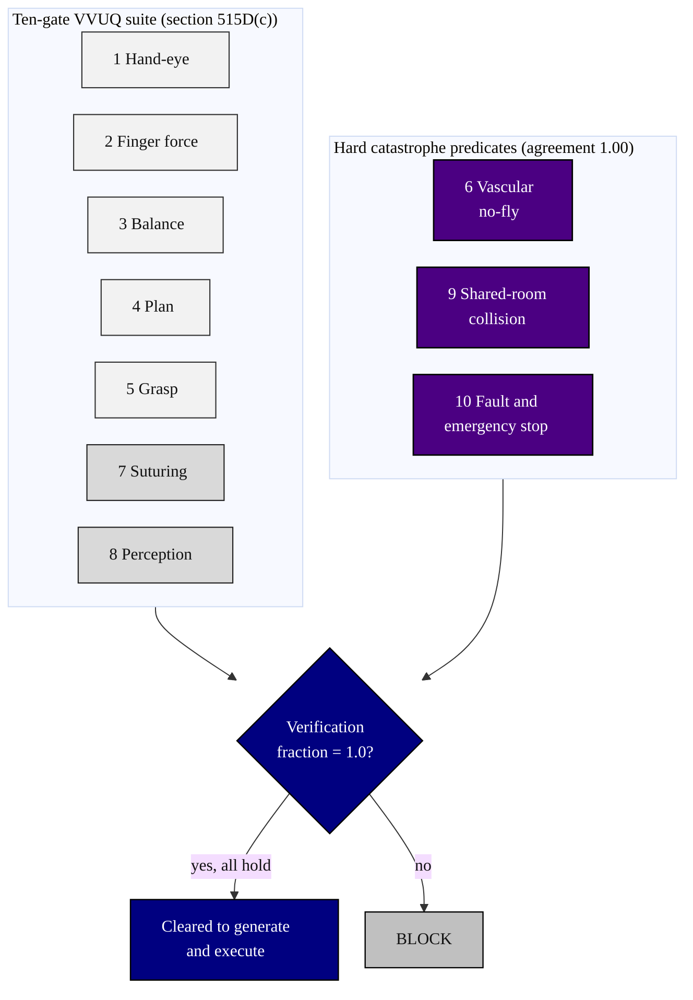


---

### 05. The Amendment Map

What the bill changes in the United States Code: a single new section 515D
(21 U.S.C. 360e-5) carries ten conforming amendments across Title 21, from the
device definition to State preemption, plus a clerical update to the table of
contents. A clustered flowchart is correct because one new section radiates targeted
edits into existing law. Reproduced in the compiled LaTeX framework as a matching
colored TikZ figure (palette: black, grayscales, #4B0082, #000080, #C0C0C0).

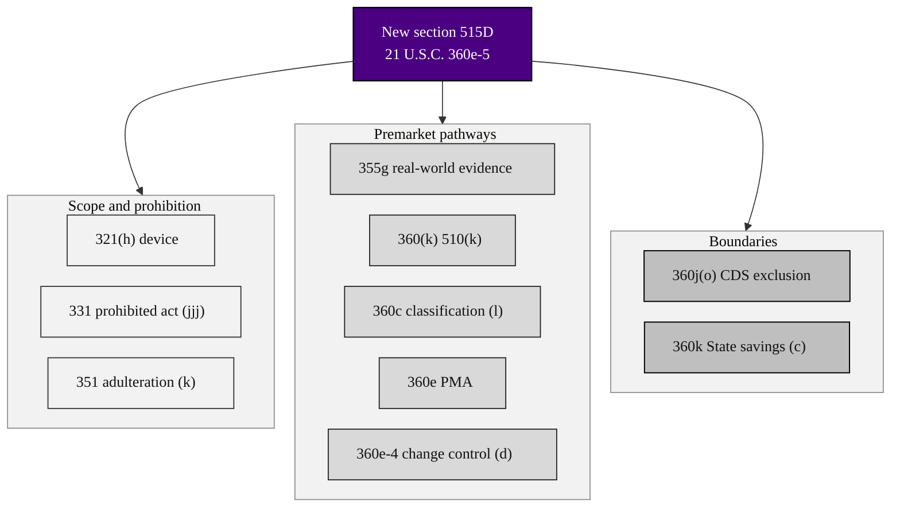


---

### 06. The Legislative Journey

The path the bill must travel: introduction and referral, subcommittee and full
committee markup, House floor passage, the same sequence in the Senate, conference
or amendment exchange, and finally enrollment and signature. A journey diagram is
correct because it scores each stage as a sentiment the sponsor must manage, not
just a box to clear. Reproduced in the compiled LaTeX framework as a matching
colored TikZ figure (palette: black, grayscales, #4B0082, #000080, #C0C0C0).

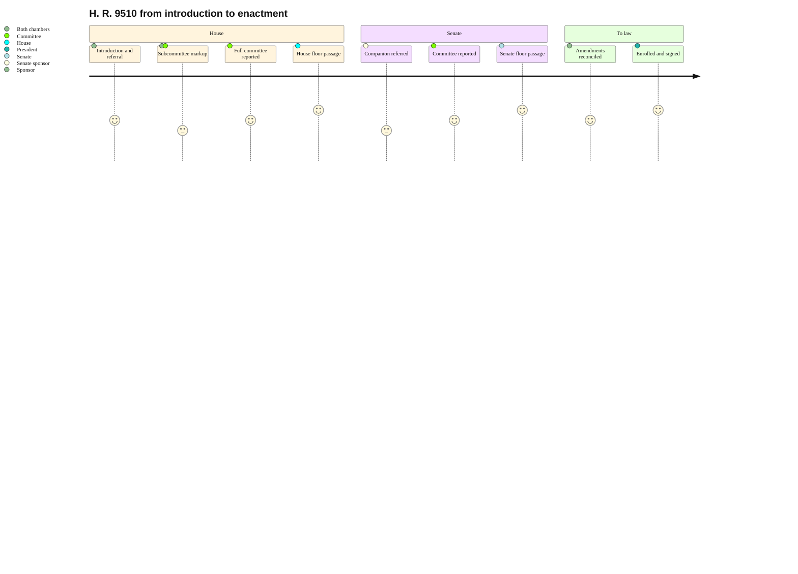


---

### 07. The Fiscal Picture

What the bill authorizes and when: a declining authorization from 18 million dollars
in FY 2027 to 9 million dollars in FY 2031, 58 million dollars in all, with outlays
of 53.5 million dollars inside the window and no new mandatory spending. A timeline
is correct because the fiscal story is a dated, multi-year schedule a scorekeeper
reads year by year. Reproduced in the compiled LaTeX framework as a matching colored
TikZ figure (palette: black, grayscales, #4B0082, #000080, #C0C0C0).

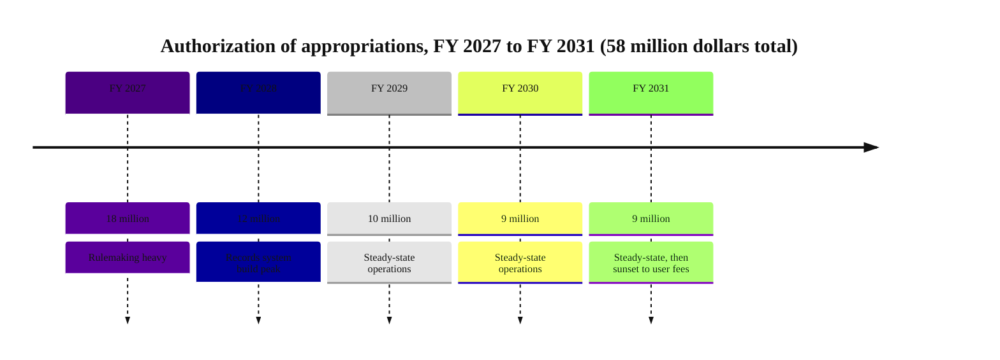


---

### 08. The Cost Asymmetry

The argument that disarms the fiscal objection: the verification gate is priced in
compute, storage, and bounded human review (small, fixed, measurable), while the
embodied failure it prevents is priced in lives and litigation (large, unbounded). A
quadrant chart is correct because it places each item on the two axes that matter to
a scorekeeper, cost magnitude and predictability. Reproduced in the compiled LaTeX
framework as a matching colored TikZ figure (palette: black, grayscales, #4B0082,
#000080, #C0C0C0).

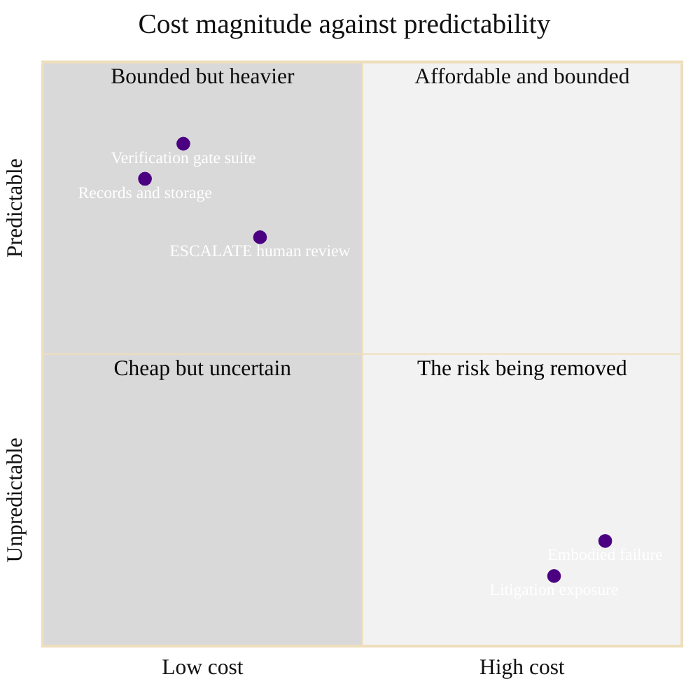


---

### 09. Authority and the State Savings Clause

Why the bill is within Congress's power and respectful of the States: it acts on
interstate commerce in medical devices through the Federal Food, Drug, and Cosmetic
Act, sets a Federal floor in section 515D, and preserves State laws that require a
licensed human to monitor or override the system through a savings clause in section
360k(c). A top-down flowchart is correct because authority flows from a source to a
floor and then carves out what it does not displace. Reproduced in the compiled
LaTeX framework as a matching colored TikZ figure (palette: black, grayscales,
#4B0082, #000080, #C0C0C0).

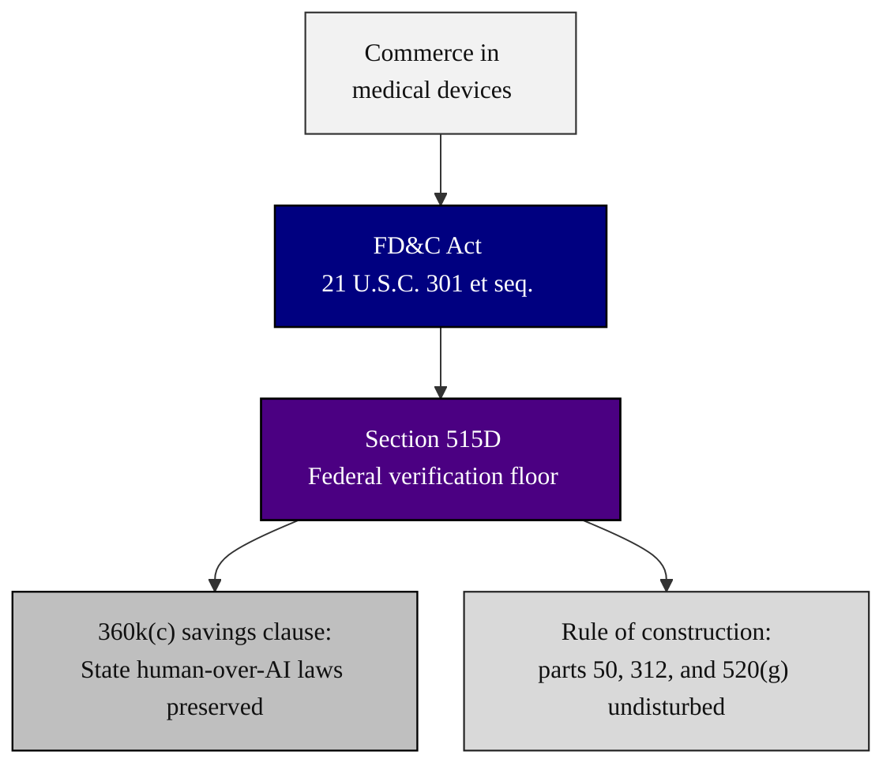


---

### 10. The Recognized Standards Basis

The bill does not invent its rigor; each gate is bound to a published consensus
standard, so the verification floor rests on work the relevant professions already
trust. A sankey diagram is correct because it shows several recognized standards
flowing into the one ten-gate examination the statute requires. Reproduced in the
compiled LaTeX framework as a matching colored TikZ figure (palette: black,
grayscales, #4B0082, #000080, #C0C0C0).

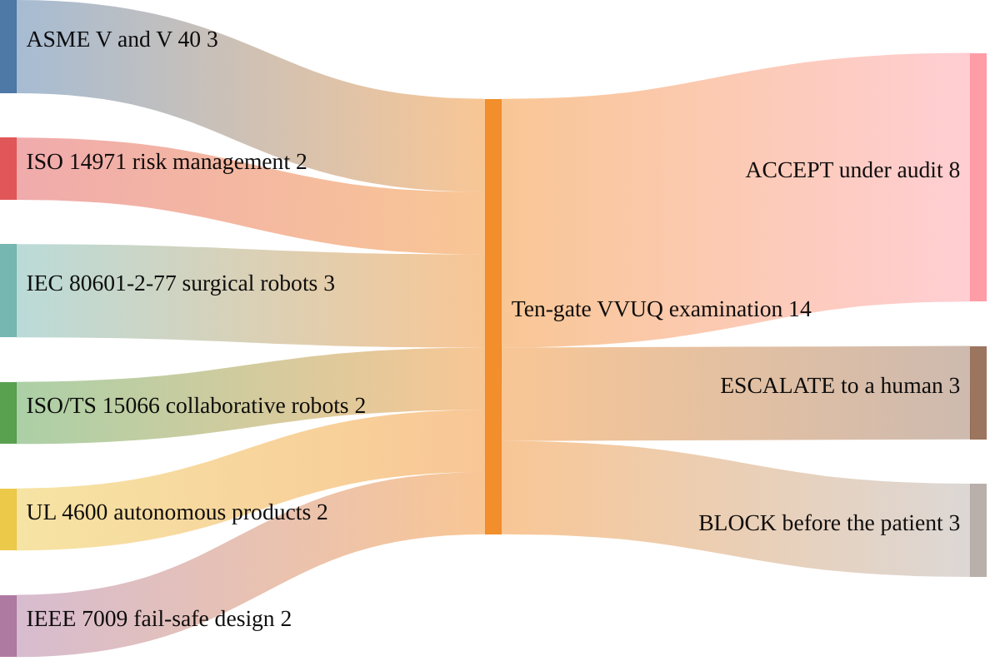


---

### 11. Constituent Reach

Why a member in any State has a stake: the platform's rollout grows from a single
site to fifty through one hundred operational sites across all major regions, so the
bill that enables it touches rural and urban districts alike. A block diagram is
correct because the content is a staged grid of capacity that a member reads against
their own district. Reproduced in the compiled LaTeX framework as a matching colored
TikZ figure (palette: black, grayscales, #4B0082, #000080, #C0C0C0).

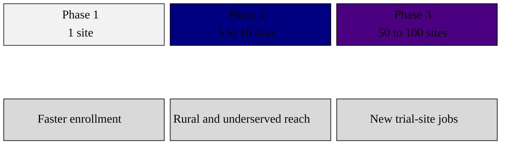


---

### 12. Where the Two Caucuses Converge

The bipartisan case in one figure: an innovation-and-deregulation appeal and a
patient-safety-and-oversight appeal start from different premises but converge on the
same vote, because verification before generation both speeds credible deployment
and sets a hard safety floor. A converging flowchart is correct because it shows two
distinct motivations meeting at one outcome. Reproduced in the compiled LaTeX
framework as a matching colored TikZ figure (palette: black, grayscales, #4B0082,
#000080, #C0C0C0).

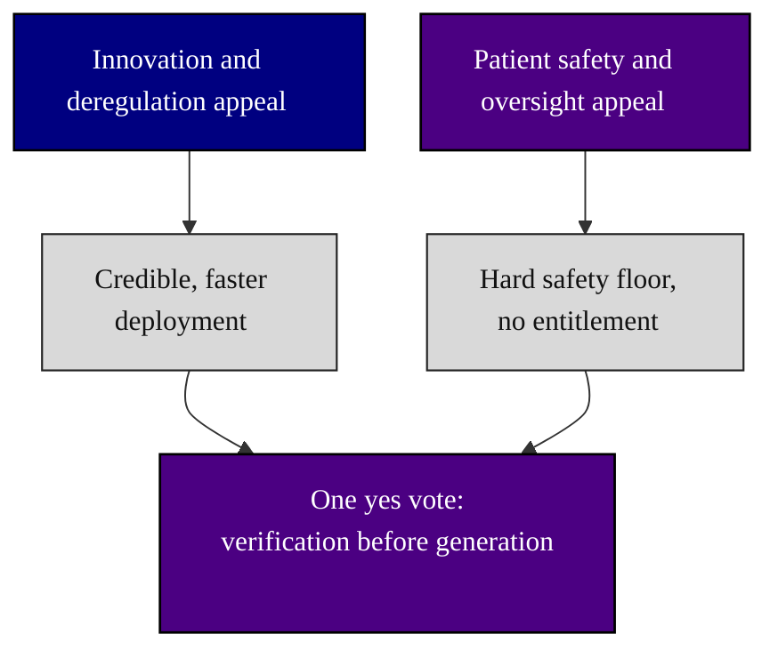


---

### 13. The Supporting Coalition

Who stands behind the bill and why no organized opponent is evident: medical
societies, patient advocates, industry and standards bodies, and the States each find
something to support, from a clear safety floor to predictable rules of the road. A
mindmap is correct because it radiates one center (support for H. R. 9510) into the
distinct stakeholder groups that compose a coalition. Reproduced in the compiled
LaTeX framework as a matching colored TikZ figure (palette: black, grayscales,
#4B0082, #000080, #C0C0C0).

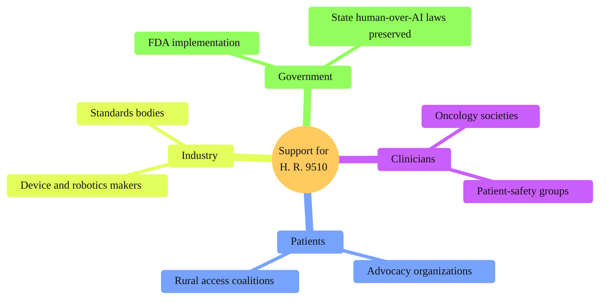


---

### 14. The Platform as Proof of Implementability

The answer to "can this actually be done": the National Platform's validated
simulation treated 168 patients with 29 robots across 15 cancer types at 99.7
percent uptime with zero patient harm events, which turns the bill from an
aspiration into a codification of something already shown to work. A left-to-right
flowchart is correct because it traces evidence into a conclusion a member can cite.
Reproduced in the compiled LaTeX framework as a matching colored TikZ figure
(palette: black, grayscales, #4B0082, #000080, #C0C0C0).

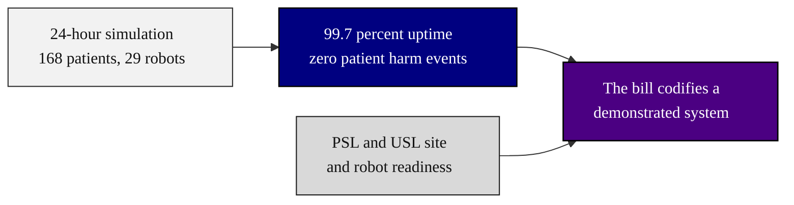


---

### 15. The Two-Chamber Strategy

How passage in one chamber is converted into law: a Senate companion is introduced
in parallel, each chamber reports and passes its version, and the differences are
reconciled by amendment exchange or conference before enrollment. A sequence diagram
is correct because the content is an ordered exchange of messages between two
chambers over time. Reproduced in the compiled LaTeX framework as a matching colored
TikZ figure (palette: black, grayscales, #4B0082, #000080, #C0C0C0).

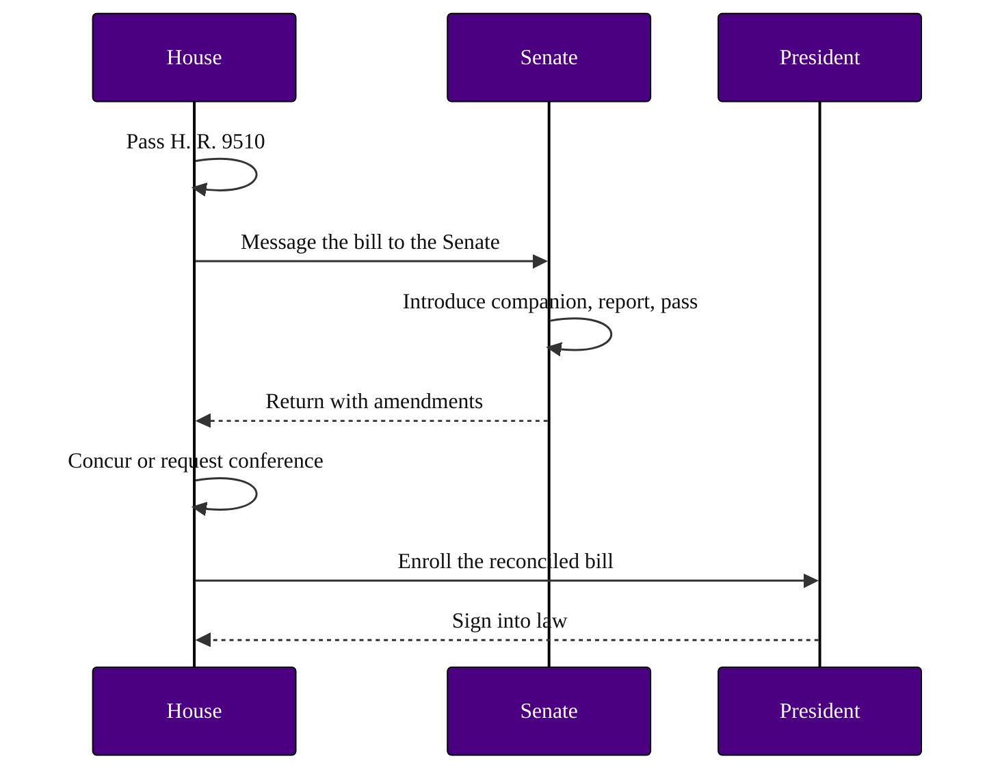


---

### 16. The Markup Lifecycle

How a bill is improved without being lost: it is introduced, a committee print and a
manager's amendment refine it on a working branch, and the refined text merges back
as the reported bill that goes to the floor. A gitGraph is correct because markup is
literally a branch-and-merge of legislative text. Reproduced in the compiled LaTeX
framework as a matching colored TikZ figure (palette: black, grayscales, #4B0082,
#000080, #C0C0C0).

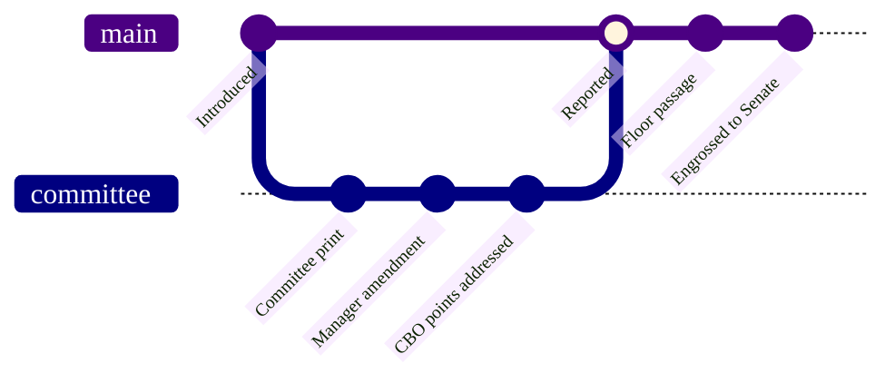


---

### 17. The Vote Thresholds

What "passage" concretely requires: a simple majority in the House, sixty votes to
invoke cloture in the Senate, and a simple majority to pass the Senate, each
satisfied by a recorded action. A requirement diagram is correct because it states
the thresholds as formal requirements and links the action that verifies each.
Reproduced in the compiled LaTeX framework as a matching colored TikZ figure
(palette: black, grayscales, #4B0082, #000080, #C0C0C0).

```mermaid
%%{init: {'theme':'base','themeVariables':{'fontFamily':'Helvetica, Arial, sans-serif','primaryTextColor':'#111111'}}}%%
requirementDiagram
  requirement HousePassage {
    id: 1
    text: Simple majority of the House, 218 of 435.
    risk: medium
    verifymethod: test
  }
  requirement SenateCloture {
    id: 2
    text: Sixty votes to end debate.
    risk: high
    verifymethod: test
  }
  requirement SenatePassage {
    id: 3
    text: Simple majority of the Senate, 51 of 100.
    risk: medium
    verifymethod: test
  }
  element HouseRollCall {
    type: recorded_vote
  }
  element ClotureMotion {
    type: recorded_vote
  }
  element SenateRollCall {
    type: recorded_vote
  }
  HouseRollCall - satisfies -> HousePassage
  ClotureMotion - satisfies -> SenateCloture
  SenateRollCall - satisfies -> SenatePassage
  SenateCloture - derives -> SenatePassage
```


---

### 18. Handling the Standard Objections

How each predictable objection is answered rather than avoided: a stated objection
(cost, federal overreach, innovation chill, or redundancy) is met with the specific
cited provision that resolves it, and only a genuinely new concern is routed to an
amendment. A flowchart is correct because objection handling is a routed decision
that mostly terminates in a citation. Reproduced in the compiled LaTeX framework as a
matching colored TikZ figure (palette: black, grayscales, #4B0082, #000080,
#C0C0C0).

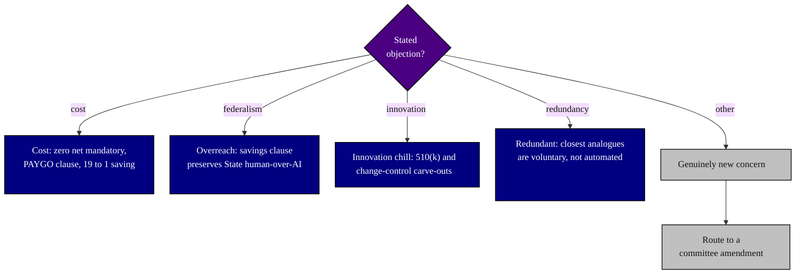


---

### 19. The Scoring Path

How the bill clears the budget points of order: once introduced it is scored, the
authorization is found to create no direct spending and no revenue effect, the PAYGO
scorecard reads zero, and the bill is CutGo compatible and cleared for the floor. A
state diagram is correct because scorekeeping is a sequence of states with one guard
that could send a bill back for an offset. Reproduced in the compiled LaTeX
framework as a matching colored TikZ figure (palette: black, grayscales, #4B0082,
#000080, #C0C0C0).

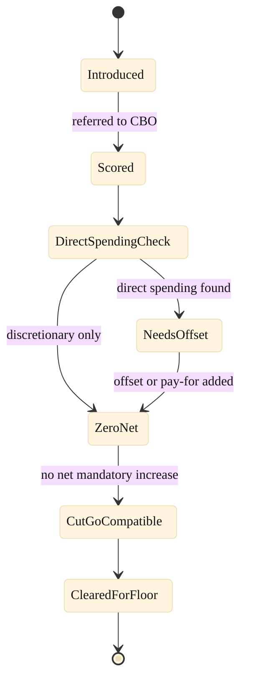


---

### 20. From One Yes to Enactment

The capstone: the eight answered questions become one member's yes, that yes becomes
a committee report, the report becomes House and Senate passage, and the two
chambers become enacted law that the platform is ready to implement. A top-down
flowchart is correct because it closes the framework by tracing a single decision up
to the statute it produces. Reproduced in the compiled LaTeX framework as a matching
colored TikZ figure (palette: black, grayscales, #4B0082, #000080, #C0C0C0).

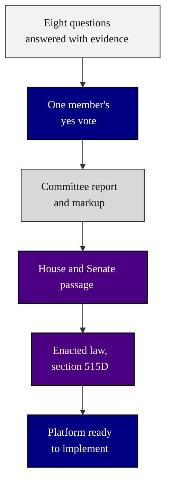


---

